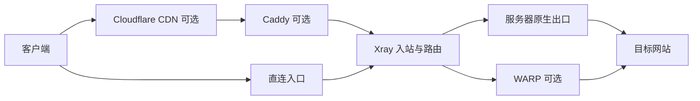

# Xray 多协议安装与管理脚本

[](https://github.com/0157Martin/v2ray-manager/actions/workflows/ci.yml)

作者：[Martin&林知远](https://github.com/0157Martin)

这是一个面向 **Debian/Ubuntu** 的 Xray Core 安装与运维脚本，适用于你拥有或获授权管理的
服务器。它通过 `v2ray` 命令提供交互菜单，同时支持 VLESS、Trojan、VMess，REALITY 或
常规 TLS，以及 RAW、XHTTP、WebSocket、gRPC 等传输组合。

脚本不会在安装结束时自动打印连接凭据。安装后由你选择具体入站，再导出分享链接或原生
Xray 客户端 JSON。一个 Xray 服务可以运行多个独立入站；每个入站还可以生成最多 10 条
具有独立凭据、可同时使用的子链接。

快速导航：[选择协议](#如何选择协议) · [安装](#一行安装) · [管理命令](#管理命令) ·
[Caddy](#caddy-网站伪装与反向代理) · [非交互安装](#非交互安装) ·
[WARP](#warp-出站管理) · [连接排障](#导入后延迟为--1--无法连接) ·
[完整项目讲解](docs/PROJECT_GUIDE.md) · [6.0.0 更新说明](docs/RELEASE_6.0.0.md)

第一次使用建议先阅读 [项目使用与原理指南](docs/PROJECT_GUIDE.md)。它按客户端、Caddy、
Xray、WARP 和目标网站的实际流量顺序解释组件职责，并给出安装、端口规划、多人使用、
更新回滚和延迟 `-1` 的操作步骤。



详细的路径匹配、路由决策、配置生成、systemd 健康检查和失败回滚图见
[转发机制原理图](docs/PROJECT_GUIDE.md#4-转发机制原理图)与
[项目运行原理图](docs/PROJECT_GUIDE.md#5-项目运行原理图)。

## 功能概览

**5.7.2 运维变更：**代理用户默认不能访问服务器回环、私网或链路本地目标，包括本机 Caddy
管理端口；此策略对原生出口和 WARP 都生效，`warp off` 不会解除隔离。已有入站会迁移到数据
版本 4，原先运行的 Xray 会重启以应用策略；原先停止的服务保持停止。确实需要内网代理的部署
应先评估访问白名单，不应直接移除全部保护规则。

配置修改、证书部署、升级和恢复使用同一进程间写锁；菜单空闲时不占锁。修改失败会恢复
Xray 配置、节点状态、证书和 Caddy 配置。恢复失败时会输出保留现场的位置。此事务不回滚
系统软件包安装、外部 ACME 账户或 WARP 设备注册，也不能保证 SIGKILL/断电后的自动恢复。

- 安装或更新 Xray Core，并校验官方发布包的 SHA-256 摘要。
- 交互选择 12 种协议组合；安装过程不会静默创建或输出默认链接。
- 管理多个入站，包括添加、修改、启用、停用、删除和批量导出。
- 为单个入站维护 1–10 个独立用户凭据，配置失败时自动回滚。
- 自动生成并校验 UUID、REALITY X25519 密钥、Short ID 和 TLS 证书。
- 从现有证书导入，或使用 Certbot 申请及续期；部署失败恢复原证书。
- 安装 Caddy，创建伪装站点，或为 XHTTP/WebSocket 配置本机反向代理。
- 提供防火墙、服务状态、日志、Speedtest、回程路由、丢包和延迟诊断。
- 自动保留最近 10 份配置备份，支持 Xray、管理脚本和配置的独立更新与回退。
- 使用低权限 `xray` 系统账户，并对 systemd 服务进行基础加固。

## 如何选择协议

如果没有必须兼容的旧客户端，可从下面三类中选择：

- **直接连接、没有自有证书：**优先选择 `VLESS-REALITY-Vision-RAW`。
- **需要 Cloudflare 橙云或 HTTP CDN：**选择普通 TLS 的 XHTTP、WebSocket 或 gRPC；其中
  WebSocket 的客户端和 CDN 兼容范围通常最广。
- **已有旧版客户端：**使用 VMess 或传统 Trojan 组合；新部署优先考虑 VLESS。

| 编号 | 菜单名称 | 适用场景 | Cloudflare 普通橙云 |
| --- | --- | --- | --- |
| 1 | VLESS-REALITY-Vision-RAW | 推荐的高性能直连方案，无需自有证书 | 不支持 |
| 2 | VLESS-REALITY-XHTTP | 使用 XHTTP 传输，但 REALITY 仍需直连 | 不支持 |
| 3 | VLESS-REALITY-gRPC | 使用 gRPC 传输，但 REALITY 仍需直连 | 不支持 |
| 4 | VLESS-XHTTP-TLS | Caddy 在 443 终止 TLS，通过本机 h2c 转发到 Xray；支持 HTTP CDN | 支持 |
| 5 | VLESS-WebSocket-TLS | 广泛兼容客户端和 HTTP CDN | 支持 |
| 6 | VLESS-gRPC-TLS | 已有 HTTP/2 或 gRPC 反向代理 | 有条件支持 |
| 7 | Trojan-REALITY-RAW | 需要 Trojan 客户端语义的 REALITY 直连 | 不支持 |
| 8 | VMess-TCP | 无 TLS 的旧版兼容或可信链路 | 不支持 |
| 9 | VMess-WebSocket-TLS | 旧客户端与 HTTP CDN 兼容 | 支持 |
| 10 | VMess-gRPC-TLS | 旧客户端与现有 HTTP/2 反代兼容 | 有条件支持 |
| 11 | Trojan-WebSocket-TLS | 传统 Trojan、WebSocket 和 TLS | 支持 |
| 12 | VLESS-TLS-Vision-RAW | 自有证书的 Vision 直连方案 | 不支持 |
| 13 | Hysteria2-TLS-QUIC（实验） | UDP/QUIC 直连，需要证书和开放 UDP 端口 | 不支持 |

### REALITY 使用前须知

REALITY 不是普通 TLS 证书的替代配置项，而是一种借用目标站 TLS 握手特征的传输安全机制。它不需要为
入站申请证书，但客户端需要支持 REALITY，且必须拿到同一入站导出的公钥（`pbk`）、Short ID（`sid`）
和 SNI。官方文档限定 REALITY 只能配合 **RAW、XHTTP 或 gRPC**；本项目也只在这三种传输中提供
REALITY 组合。[Xray REALITY 配置说明](https://xtls.github.io/config/transport.html#realityobject) 将其
定义为经过修改的 TLS，并说明客户端指纹参数不能关闭 uTLS。

- **入口必须直连：**客户端入口域名应解析到 VPS，并使用 Cloudflare 灰云（DNS only）。普通橙云不能
  代理 REALITY/RAW 的任意 TCP 流量；Caddy 的 HTTP 反代也不能放在 REALITY 前面。
- **目标站不是入口域名：**`serverName`/SNI 指向用于伪装的目标站；分享链接中的服务器地址则指向你的
  VPS。两者填反会导致连接失败或把流量送往错误的位置。
- **先检查再使用：**目标站至少应稳定支持 TLS 1.3、H2、有效证书链和相应 SNI。本项目在创建或修改
  REALITY 入站时会做这些检查；检查不通过时应换站点，不要通过关闭验证强行继续。
- **认证失败会回落：**为保持外部表现，Xray 会把未通过 REALITY 认证的连接直接转发给 `target`。
  因此应避免把公共 CDN 或可能产生高成本流量的站点作为目标；官方文档也建议关注这种被扫描后滥用的
  风险，并说明可用回落限速作为最后手段。详见 [官方 REALITY 参数文档](https://github.com/XTLS/Xray-docs-next/blob/main/docs/en/config/transports/reality.md)。
- **更新或轮换后重新导入：**执行 `v2ray rotate <入站ID>` 后，旧的公钥和 Short ID 立即失效；用
  `v2ray links` 重新导出对应链接，再在客户端更新。

“不支持橙云”不等于不能使用 Cloudflare DNS。可以把域名托管在 Cloudflare，但应将代理
状态设为 **DNS only（灰云）**，让客户端直接连接服务器。

### Cloudflare 使用范围

本项目没有任何协议必须经过 Cloudflare。Cloudflare 可以只负责 DNS，也可以作为可选的
HTTP/HTTPS 反向代理；是否开启橙云取决于所选协议。使用灰云（DNS only）时，客户端仍然
直接连接 VPS，Cloudflare 不转发流量。

| 项目 | 橙云（Proxied） | 灰云（DNS only） |
| --- | --- | --- |
| DNS 返回结果 | Cloudflare 边缘节点 IP | VPS 的真实 IP |
| 实际路径 | 客户端 → Cloudflare → VPS | 客户端 → VPS |
| Cloudflare 处理流量 | 处理受支持的 HTTP/HTTPS | 只提供 DNS 解析 |
| 适合的本项目组合 | Caddy 网站、XHTTP、WebSocket、符合条件的 gRPC | REALITY、RAW、VMess TCP 等直连协议 |
| 公网端口建议 | `443` | 以入站实际端口为准 |

橙云可以使一般访客不直接看到源站 IP，但它不等同于任意 TCP 代理。使用橙云时，Caddy 仍然
应配置真实域名的 HTTPS，Cloudflare 的 SSL/TLS 模式建议设为 **Full (strict)**。灰云不经过
Cloudflare，DNS 会直接给出服务器地址，因此适合需要端到端原始 TCP/TLS 握手的 REALITY。

同一台服务器同时部署 Caddy HTTP 入站和 REALITY 时，建议使用两个子域名，分别设置代理状态：

```text
www.example.com       橙云 → Caddy 网站 / XHTTP / WebSocket
reality.example.com   灰云 → REALITY / RAW 直连
```

普通橙云只代理 Cloudflare 支持的 HTTP/HTTPS 端口。HTTPS 推荐使用 `443`，也支持
`2053`、`2083`、`2087`、`2096` 和 `8443`；项目使用 CDN 域名导出时固定生成公网
`443` 入口。WebSocket 可用于 Cloudflare 各套餐。gRPC 节点还需要 TLS、HTTP/2、ALPN、
代理状态为橙云、SSL/TLS 模式至少为 Full，并在控制台打开 `Network → gRPC`。

RAW、REALITY、VMess TCP 等任意 TCP 流量不能由普通橙云转发。确需让这类流量经过
Cloudflare 时，需要单独评估 Cloudflare Spectrum；任意 TCP/UDP 代理通常涉及 Enterprise
套餐，不能把 Spectrum 能力等同于普通免费橙云。

#### Cloudflare 控制台推荐配置

下面以 `cdn.example.com` 作为 Caddy + XHTTP/WS 的公网域名。Cloudflare 控制台的名称可能
随版本调整，但对应功能不变。先确保 Caddy 站点和 Xray 路径在灰云下能够正常连接，再开启
橙云，这样出错时可以区分源站配置问题和 CDN 配置问题。

1. 在 `DNS → Records` 新建 `A` 记录：名称填 `cdn`，IPv4 地址填 VPS 公网 IP，代理状态先设为
   `DNS only`。如果服务器确实配置了可用的公网 IPv6，再添加 `AAAA`；没有配置 IPv6 时不要
   添加占位 AAAA 记录。验证 Caddy 和节点正常后，把支持 CDN 的域名切换为 `Proxied`（橙云）。
   REALITY、RAW 和普通 TCP 入站应使用另一个灰云子域名。
2. 在 `SSL/TLS → Overview` 选择 `Full (strict)`。源站 Caddy 必须在 443 提供未过期、域名匹配、
   受信任的证书；本项目默认使用 Caddy/Certbot 可用的公开 CA 证书。不要选择 `Flexible`，因为
   它不会以 HTTPS 连接源站，并可能造成重定向循环。确认 `SSL/TLS → Edge Certificates` 中
   Universal SSL 证书状态为 Active。最低 TLS 版本建议保留 `TLS 1.2`，兼顾常见客户端。
3. 公网入口使用 `443`。虽然 Cloudflare 还代理 `2053`、`2083`、`2087`、`2096`、`8443` 等
   HTTPS 端口，但项目用 CDN 域名导出的客户端入口固定为 443，Caddy 也按公网 443 设计。
   Xray 的 `24443` 等端口只是本机后端，不应填写到 Cloudflare，也不应对公网开放。
4. 使用 WebSocket 时，到 `Network → WebSockets` 确认开关为 On。使用 gRPC 时，还要打开
   `Network → gRPC`；gRPC 域名必须是橙云，公网端点必须为 443，并支持 TLS、HTTP/2 和 ALPN。
   未使用 gRPC 时不需要为 XHTTP/WS 专门开启它。XHTTP 当前没有独立的 Cloudflare 控制台开关。
5. 在 `Caching → Cache Rules` 为节点传输路径建立 `Bypass cache` 规则。例如域名为
   `cdn.example.com`、路径为 `/xhttp` 时，可匹配主路径及其子路径：

   ```text
   (http.host eq "cdn.example.com" and
    (http.request.uri.path eq "/xhttp" or starts_with(http.request.uri.path, "/xhttp/")))
   ```

   不要对 XHTTP、WebSocket 或 gRPC 路径设置 `Cache Everything`。普通伪装站点的静态资源可以
   使用默认缓存策略。`Always Use HTTPS` 可用于伪装网站，但节点链接本身已经固定使用 HTTPS。
6. 先保持 WAF、自定义规则、Rate Limiting、Browser Integrity Check 和 Bot 功能的默认状态。
   如果 Cloudflare `Security Events` 显示节点路径的合法请求被 Block 或 Challenge，只针对该域名
   和精确路径创建例外或 `Skip` 规则，不要关闭整个站点的安全功能。免费套餐的 Bot Fight Mode
   不能通过 WAF Skip 规则绕过；若它确认误伤节点连接，需要关闭 Bot Fight Mode 或把节点放到
   不受该功能影响的独立域名/区域配置中。
7. 可选的源站加固是在 VPS 或云安全组中，让公网 80/443 只接受 Cloudflare 官方 IP 段。但只有
   当该端口上的全部服务都必须经过橙云，并且证书签发/续期方式已经验证时才这样做。同一服务器
   还承载灰云直连、REALITY，或使用需要公网 HTTP-01 的证书验证时，直接封锁非 Cloudflare 来源
   会导致直连或续期失败。橙云只隐藏正常 DNS 查询中的源站 IP，历史 DNS、邮件记录或其他灰云
   子域名仍可能暴露同一 VPS 地址。

配置完成后，用 [WhatsMyDNS](https://www.whatsmydns.net/) 查询 `A`/`AAAA`：橙云域名应返回
Cloudflare 边缘 IP，灰云域名应返回 VPS IP。再运行 `curl -I https://cdn.example.com`；响应中
出现 `server: cloudflare` 或 `cf-ray` 通常说明请求经过 Cloudflare。最后仍需用客户端测试实际
XHTTP/WS/gRPC 路径，因为网页返回 200 不能证明 Xray 路径已经正确转发。

Cloudflare 官方参考：

- [代理状态与 DNS only](https://developers.cloudflare.com/dns/proxy-status/)
- [Cloudflare 支持的 HTTP/HTTPS 端口](https://developers.cloudflare.com/fundamentals/reference/network-ports/)
- [WebSocket 支持及限制](https://developers.cloudflare.com/network/websockets/)
- [gRPC 要求与开启方式](https://developers.cloudflare.com/network/grpc-connections/)
- [Full (strict) 加密模式](https://developers.cloudflare.com/ssl/origin-configuration/ssl-modes/full-strict/)
- [缓存绕过规则](https://developers.cloudflare.com/cache/how-to/cache-rules/settings/)
- [WAF Skip 规则](https://developers.cloudflare.com/waf/custom-rules/skip/)
- [保护源站](https://developers.cloudflare.com/fundamentals/security/protect-your-origin-server/)
- [Spectrum TCP/UDP 代理](https://developers.cloudflare.com/spectrum/)

普通 TLS 入站需要有效证书。脚本不会自动修改 DNS、Caddy 或 Nginx；只有你主动进入
“Caddy 网站管理”或执行 `v2ray caddy ...` 时才会写入 Caddy 配置。你可以导入已有 PEM
证书和私钥；未提供时，脚本先查找匹配证书，找不到才使用 Certbot。自动申请要求域名指向
本机且公网 TCP 80 可达，并会接受 Let's Encrypt 服务条款。默认 standalone 模式要求
本机 80 空闲；已有网站可设置 `V2M_ACME_WEBROOT=/var/www/html` 使用 webroot 验证。如果目标域名已经由本项目生成的 Caddy 站点管理，且站点根目录仍与配置一致，管理器会自动使用该 webroot，不会要求停止 Caddy。

新增 XHTTP 或 WebSocket TLS 入站时，如果相同域名已经由本项目管理，管理器会在 Xray 配置生效后自动把新 Path 合并到现有 Caddy 站点。Caddy 配置校验或 reload 失败会使新增操作整体回滚。未检测到受管站点时会保留入站并提示使用 `v2ray caddy` 手动配置公网入口。分享链接会核对受管站点中的域名、Path 和 Xray 后端端口；匹配成功时，客户端入口自动导出为 Caddy 的公网 TCP `443`，不会把 `24443`、`24444` 等本机后端端口交给客户端。

如果先申请 standalone 证书、后安装 Caddy，后续 Certbot 续期会与 Caddy 争用 TCP 80。
管理器现在会检查 `/etc/letsencrypt/renewal/*.conf` 并拒绝这种组合。请先使用受支持的 Certbot
流程把相关证书迁移为 DNS 验证，或在已能提供 HTTP challenge 的网站上配置 webroot，并执行
`certbot renew --dry-run`；仅在当前 shell 设置 `V2M_ACME_WEBROOT` 不会改变已有证书的续期配置。
对已经存在的 Caddy/standalone 组合，`v2ray doctor` 会报告冲突；管理器不会擅自停止网站或修改
外部证书账户来完成迁移。已经运行的 Caddy 仍允许重载现有站点和同步升级所需的 XHTTP 路由；
阻止重载无法释放已被 Caddy 占用的端口，反而会让 Xray 与 Caddy 停留在不一致的协议状态。

## 一行安装

请使用 root 用户运行：

```bash
bash <(curl -fsSL https://raw.githubusercontent.com/0157Martin/v2ray-manager/main/install.sh)
```

只有 `wget` 时：

```bash
bash <(wget -qO- https://raw.githubusercontent.com/0157Martin/v2ray-manager/main/install.sh)
```

生产服务器建议先审阅 [install.sh](https://github.com/0157Martin/v2ray-manager/blob/main/install.sh) 和 [v2ray.sh](https://github.com/0157Martin/v2ray-manager/blob/main/v2ray.sh)。

### 安装注意事项

安装前请逐项确认：

- **系统与权限：**仅支持 Debian/Ubuntu，使用 `root` 或 `sudo -i` 运行。脚本会安装依赖、创建
  `xray` 系统账户、写入 `/etc/xray/` 和 systemd 服务；不要在由其他面板或手工 Xray 安装共同
  管理的同一目录上直接覆盖。
- **网络与软件源：**服务器需要能访问 GitHub、Xray 发布源和发行版软件源。若网络、DNS 或代理
  环境限制下载，先解决出站访问问题；不要从不明镜像复制一行安装命令。远程执行前可先审阅上面的
  `install.sh` 与 `v2ray.sh`。
- **端口规划：**添加入站前检查 `80`、`443` 及计划使用的端口是否已被 Nginx、Caddy、Apache 或
  其他服务占用。TLS 自动申请证书通常要求公网 TCP `80` 可达；使用 Caddy 时让 Caddy 独占
  公网 `80/443`，并为 Xray TLS HTTP 入站选择本机后端端口。
- **防火墙与云安全组：**UFW/firewalld 可以由 `v2ray firewall` 处理，但云厂商安全组、上游 NAT
  和机房防火墙必须由你自行放行。以导出的链接端口为准，而不是只假设一定使用 `443`。
- **域名与协议：**普通 TLS/HTTP CDN 组合需要你拥有并能解析到服务器的证书域名。REALITY 不申请
  本机证书，但仍要求一个指向 VPS 的客户端入口域名，以及单独通过检查的目标站/SNI；入口域名与
  REALITY 目标站不能互换。
- **避免泄露凭据：**安装完成不自动输出连接链接。执行 `v2ray links` 后，其中的 UUID、Trojan
  密码、公钥和 Short ID 都应视为访问凭据，不要贴到工单、日志或公开截图中。

安装只部署 Xray Core、systemd 服务和管理命令，不会弹出协议选择，也不会创建或显示默认
链接。先手动添加需要的协议，再检查和导出：

```bash
v2ray add                # 手动选择协议并添加第一个入站
v2ray doctor             # 检查配置、证书、监听端口和服务状态
v2ray inbounds           # 查看可用的入站 ID
v2ray links              # 输出全部启用入站的分享链接
```

也可以运行 `v2ray`，进入“入站管理 → 添加新入站”。如需输出单个入站，先用
`v2ray inbounds` 查看实际 ID，再运行 `v2ray link <入站ID>`。

## 管理命令

```bash
v2ray                  # 打开菜单
v2ray add              # 添加独立入站
v2ray inbounds         # 查看入站列表
v2ray links            # 输出全部启用入站链接
v2ray users            # 打开子链接用户管理菜单
v2ray users list       # 按协议分组查看入站及链接数量
v2ray users list primary          # 查看指定入站的链接用户
v2ray users add primary 2         # 新增两条链接，保留现有凭据
v2ray users delete primary 3      # 删除第 3 条链接
v2ray users replace primary 2     # 重新生成第 2 条链接的凭据
v2ray users show primary          # 输出该入站的全部分享链接
v2ray users set primary 5         # 兼容模式：直接设置链接总数
v2ray firewall         # 放行已启用入站的本机 UFW/firewalld TCP 端口
v2ray info             # 查看版本和连接信息
v2ray version          # 查看管理脚本版本
v2ray change [入站ID]  # 修改指定入站；单入站自动选择，多入站提示选择
v2ray config           # change 的兼容别名
v2ray link             # 重新显示默认入站链接
v2ray link primary edge.example.net # 用 CDN 域名导出，SNI/Host 仍使用原证书域名
v2ray client           # 输出默认启用入站的 Xray 客户端 JSON
v2ray client primary   # 按入站 ID 导出；ID 见 v2ray inbounds
v2ray status           # 查看服务状态
v2ray start
v2ray stop
v2ray restart
v2ray log              # 查看最近 100 条日志
v2ray speedtest        # 测试服务器下载、上传速度和延迟
v2ray route 1.1.1.1    # 测试 VPS 到目标的回程路由、丢包和逐跳延迟
v2ray warp             # 管理全部协议共用的 WARP 出站策略
v2ray caddy            # 打开 Caddy 网站管理菜单
v2ray update           # 更新到项目固定的 Xray 基线，保留配置
v2ray update.core --version v26.3.27 --check # 只检查指定目标版本
v2ray update.core --latest # 显式选择上游最新稳定发布
v2ray rollback.core    # 恢复上次内核与 GeoData
v2ray upgrade          # 一键更新项目脚本、迁移数据并保留现有链接
v2ray update.sh        # upgrade 的兼容别名
v2ray rollback.sh      # 恢复上一次更新前的脚本及关联数据
v2ray recover          # 恢复中断的管理脚本事务
v2ray rotate [入站ID]  # 轮换所选入站的 REALITY 密钥和 Short ID
v2ray backup           # 创建配置备份
v2ray restore          # 恢复最近一份备份
v2ray doctor           # 运行综合诊断
v2ray doctor --json    # 输出不含凭据的结构化本机诊断
v2ray doctor --prometheus # 输出本机检查的 Prometheus 文本指标
v2ray plan desired.json   # 预览已有入站的声明式变更，不写入状态
v2ray apply desired.json  # 在事务和自动回退保护下应用变更
v2ray xhttp-mode primary packet-up # 设置 XHTTP 客户端模式
v2ray uninstall
```

`plan/apply` 当前只管理已有入站的启停、入口域名、备注和 XHTTP 客户端模式，不在清单中生成
凭据或新建节点。示例见 [`examples/desired-state.json`](examples/desired-state.json)。状态文件名继续保留
`.env`/`.disabled` 以兼容现有目录布局，但 6.5.0 起内容为 JSON，管理器不会执行其中的 Shell。

Hysteria2 TLS/QUIC 是实验性配置，要求 Xray `v26.3.27` 或更新版本，并需放行对应 UDP 端口。
非交互创建时还需显式设置 `V2M_EXPERIMENTAL=1`。本机诊断只检查本机配置、进程和监听状态；
`public_reachability: "not_checked"` 表示它不能替代外网客户端连通性验证。

主菜单按“安装、入站管理、连接与导出、Xray 服务、Caddy、WARP、维护诊断、卸载”分组，并显示
Xray、Caddy 运行状态以及启用、停用入站数量。安装结束时不会自动输出凭据；需要分享链接
或客户端 JSON 时，进入“连接与导出”并选择对应入站。子菜单中选择 `0` 返回主菜单。

入站管理的修改、停用、启用和删除均支持批量选择。输入多个入站 ID 时可使用空格或逗号
分隔，例如 `xray-reality xray-reality-1`；输入 `all` 会选择当前操作所适用的全部入站。
批量修改可统一更新客户端入口域名或 REALITY 目标域名，也可逐个执行完整编辑；所有目标
验证完成后只重建一次配置并重启一次 Xray。批量删除会列出目标，并要求输入完整的
`DELETE` 才会执行。

“连接与导出 → 子链接用户管理”提供查看、新增、删除、重新生成和输出链接。入站列表按
REALITY 直连、TLS HTTP/CDN、其他直连与旧版兼容分组，并直接显示每个入站的链接数量。
用户列表通过序号和脱敏凭据标识区分链接，避免普通查看操作打印完整 UUID。

这些链接共享协议、域名、端口、传输路径和 TLS/REALITY 参数，但 UUID（Trojan 中作为
密码）不同，可以同时使用。新增操作保留全部已有凭据；删除只移除指定序号；重新生成只让
指定序号的旧链接失效。删除后序号会重新连续排列。每个入站至少保留 1 条、最多 10 条链接。
`v2ray client <入站ID>` 只导出第一条凭据；使用 `v2ray users show <入站ID>` 或
`v2ray link <入站ID>` 查看该入站的全部分享链接。旧命令 `v2ray users <入站ID> <数量>`
继续可用，等同于 `v2ray users set <入站ID> <数量>`。

入站 ID、链接序号和客户端备注是三个不同概念。例如入站列表中的 `Martin1-2` 可以是一个
完整的独立入站 ID，并不表示 `Martin1` 的第 2 条链接。若 `Martin1-2` 的链接数为 1，轮换
它的唯一 UUID 应执行 `v2ray users replace Martin1-2 1`；`v2ray users replace Martin1 2`
表示轮换 `Martin1` 入站内部已经存在的第 2 条 UUID。需要新增 UUID 时使用
`v2ray users add Martin1 1`。从 5.7.1 起，轮换不存在的序号会显示当前链接数并提示新增命令。
客户端备注只用于显示，链接生成器会进行 URI 编码，不参与 Caddy 路由或 Xray认证。

“维护与诊断 → 路由、丢包与延迟测试”使用 `ping` 和 10 轮 MTR 报告测试 VPS 到指定客户端
公网 IP 或域名的回程方向，并显示逐跳丢包和平均延迟。首次使用会从系统仓库安装
`mtr-tiny`、`iputils-ping` 和 `traceroute`。真实去程依赖客户端运营商网络，必须从客户端
发起；菜单会根据当前节点地址和端口生成 Windows PowerShell、Linux/macOS 测试命令。
逐跳星号或中间节点丢包可能只是路由器限制 ICMP，需结合最终目标的丢包与延迟判断。

执行 `rotate` 后旧客户端链接会立即失效，需要重新导入新链接。

`v2ray speedtest` 也可从“维护与诊断 → Speedtest 服务器测速”运行。脚本优先使用已安装的
Ookla `speedtest` 或 `speedtest-cli`；均不存在时安装系统仓库的 `speedtest-cli`。测速会
连接外部 Speedtest 服务器、暴露服务器公网 IP，并消耗一定流量，但不会修改或重启 Xray。

## Caddy 网站伪装与反向代理

`v2ray-manager` 作为主干统一控制 [`caddy-manager`](https://github.com/0157Martin/caddy-manager)
功能分支，负责下载、校验、调用以及与 Xray 入站的关联；Caddy 的安装、站点渲染、配置校验、
服务管理和卸载实现在分支仓库中。该分支也可以脱离主干独立安装、验证、运行和卸载：

```bash
bash <(curl -fsSL https://raw.githubusercontent.com/0157Martin/caddy-manager/main/install.sh) install
bash <(curl -fsSL https://raw.githubusercontent.com/0157Martin/caddy-manager/main/install.sh) verify
bash <(curl -fsSL https://raw.githubusercontent.com/0157Martin/caddy-manager/main/install.sh) uninstall
```

分支卸载默认保留站点配置、证书和网页数据。主干继续把 Caddy 配置纳入修改事务，分支操作失败时
恢复修改前的配置和服务状态。再次运行 `v2ray caddy install` 会先刷新主干控制的分支命令，再完成
Caddy 安装和验证。

Portfolio、Resume 和通用占位页均由 `caddy-manager` 控制。主干只转交页面类型与域名；页面仓库
选择、固定提交解析、部署清单与 SHA-256 校验、目录切换和失败回滚全部由 Caddy 分支完成。主干中
不再保留个人静态网页渲染或发布代码。

主菜单的“Caddy 网站管理”支持通过 Caddy 官方 Debian/Ubuntu 稳定仓库和 GPG key 自动安装，
并提供两种站点：

- 静态伪装网站：为域名生成独立站点目录和简单首页，由 Caddy 自动申请及续期 HTTPS 证书。
- 本机反向代理：把域名代理到 `127.0.0.1:端口`、`localhost:端口` 或 `[::1]:端口`，适合
  本机面板、API 或 Web 应用。为避免开放代理，不接受公网或局域网后端地址。

也可以使用非交互命令：

```bash
v2ray caddy install
v2ray caddy static www.example.com
v2ray caddy reverse app.example.com 127.0.0.1:8080
v2ray caddy xray cdn.example.com 127.0.0.1:24443 /a1b2c3
v2ray caddy page cdn.example.com portfolio
v2ray caddy page cdn.example.com resume
v2ray caddy page cdn.example.com default
v2ray caddy status
v2ray caddy log
```

静态站点和 Xray 路径反代站点首次配置时生成一页不含个人信息的通用占位页，不访问第三方页面
仓库。已有的 `/var/www/v2ray-manager/<域名>/index.html` 及其他静态资源始终保留，项目升级不会
覆盖或删除。需要自定义网站时，直接把自己的静态文件部署到该目录；Caddy 路由同步只更新站点
配置，不操作网页内容。占位页准备失败会恢复旧站点配置，不会报告部署成功。

6.0.1 恢复了可选个人网页部署，但不再让它参与默认安装流程。用户主动执行 `v2ray caddy page`
或使用 Caddy 菜单的“安装/更新可选网页”后，才会从独立仓库下载 Portfolio 或 Resume 的固定
提交，验证部署清单及每个文件的 SHA-256，再以同目录切换方式替换网页。下载、校验或发布失败
时保留原网页。`default` 可主动恢复通用占位页。该操作只替换网页目录，不修改 Caddy/Xray 路由。

项目不会覆盖现有 Caddyfile，而是在备份后自动追加一次
`import /etc/caddy/conf.d/*.caddy`，站点配置按域名单独保存。写入前备份主 Caddyfile，
新配置必须通过 `caddy validate` 才会 reload；失败时恢复旧站点配置。Caddy 自动 HTTPS
要求域名 A/AAAA 记录指向服务器，并确保公网 TCP 80 和 443 可达。

标准 Caddy 与 Xray 不能同时监听同一 TCP 80/443。若 Xray 或其他程序已占用其中任一端口，
管理器会拒绝安装或配置 Caddy，不会停止现有服务。请先把 Xray 入站改到其他端口，再配置
Caddy。普通 `reverse` 面向 HTTP Web 应用；`xray` 模式按 XHTTP/WS 路径反向代理，并让
其他路径显示静态伪装页。VLESS-XHTTP-TLS 只监听 `127.0.0.1`，由 Caddy 在公网 443
终止 TLS，再以 HTTP/2 明文 `h2c` 转发；WS 等既有 TLS 入站继续使用 HTTPS 后端。该模式
不能代理 REALITY/RAW。建议 Xray 使用 `24443` 等内部高位端口，Caddy 独占公网 `80/443`。
XHTTP 客户端链接固定使用域名、443、TLS、ALPN h2、相同 Host/Path 和 `mode=auto`，不应
直接连接内部端口。

从 6.0.0 起，项目统一计算客户端实际入口端口：TLS-XHTTP 固定使用 Caddy 443；WS+TLS 在
受管 Caddy 文件中的域名、Path 和后端端口全部匹配时使用 443，否则保留直连端口。`doctor`
会单独报告受管 Caddy 公网入口，避免“内部端口监听正常”被误认为完整代理链路正常。

在菜单中创建 Xray XHTTP/WS 路径反代时，管理器会按输入的 TLS 域名查找已启用的对应
入站，并自动填入它实际使用的本机端口和传输路径。直接按 Enter 会采用显示的值；没有
匹配入站时默认使用 `127.0.0.1:24443` 和 `/xhttp`。手动输入 `custom-path` 会规范化为
`/custom-path`，包含空格或连续 `/` 的路径会被拒绝并返回 Caddy 菜单，不会退出到 shell。

同一域名可以有多个 XHTTP/WS 入站。选择“同步 Xray XHTTP/WS 路径反代”时，管理器会把该
域名下全部已启用的 TLS XHTTP/WS 入站写入同一 Caddy 站点文件，每个路径分别转发到它自己的
`127.0.0.1:端口` 后端；新增入站不会覆盖既有路径。一个入站的子链接仍共享该入站的路径与
Caddy 入口，只会使用不同的 UUID 或密码。若两个入站使用相同路径，管理器会拒绝覆盖并要求先
修改其中一个路径。

项目升级会把旧 VLESS-XHTTP-TLS 后端迁移为本机 h2c，并同步已有 Caddy 站点。从 5.7.2 起，
Caddy 同步失败会使整个迁移失败并恢复配置；旧 TLS 监听缺少必要的 Caddy 入口时也会拒绝迁移。
本来已经是 h2c、但还没有 Caddy 的新入站仍需手动配置入口，不会因此被声明为已完成连通验证。

### Caddy 与 XHTTP 验证流程

网站能返回 `HTTP/2 200` 只证明根路径、TLS 和 Caddy进程正常，不能证明 XHTTP Path 已转发
到正确后端。遇到第一条节点正常、第二条节点延迟 `-1` 时，按下面顺序检查。

1. 查看域名解析：

   ```bash
   getent ahosts example.com
   ```

   灰云应解析到源站；橙云通常解析到 Cloudflare 边缘地址。解析成功不能单独证明 443 可达。

   也可以使用 [WhatsMyDNS 在线 DNS 查询](https://www.whatsmydns.net/) 对比多个地区的
   DNS 解析结果，检查修改是否已在这些查询节点生效。输入节点的完整域名（不带 `https://`
   或路径），选择 `A` 查询 IPv4；如使用 IPv6，再选择 `AAAA` 查询。灰云时应核对是否返回
   VPS 的公网 IP，橙云时应返回 Cloudflare 边缘 IP。不要只看绿色对勾，还要核对具体解析
   值；网站查询结果不代表客户端本地缓存已更新，也不能证明 XHTTP/WS 节点可以连接。

2. 确认 Caddy独占公网 443，Xray只监听本机内部端口：

   ```bash
   ss -ltnp '( sport = :443 or sport = :24443 or sport = :24444 or sport = :24445 )'
   ```

   TLS-XHTTP 修复后的结构应类似：

   ```text
   *:443              caddy
   127.0.0.1:24444    xray-core
   127.0.0.1:24445    xray-core
   ```

   Caddy 与 Xray不能同时监听同一公网 443；XHTTP h2c 内部端口也不应监听 `0.0.0.0`。

3. 校验完整 Caddy配置，包括 `import` 的站点文件：

   ```bash
   caddy validate --config /etc/caddy/Caddyfile --adapter caddyfile
   caddy adapt --config /etc/caddy/Caddyfile --adapter caddyfile --pretty
   ```

   `validate` 检查 Caddyfile适配结果、指令、模块和参数，但不能证明后端当前可以连接；
   `adapt` 用于确认 `/etc/caddy/conf.d/*.caddy` 已被主配置实际导入。

4. 确认每个 XHTTP 入站都有独立 Path 和 h2c 后端：

   ```bash
   grep -RnsE '@xray|reverse_proxy|versions h2c|flush_interval' \
     /etc/caddy/Caddyfile /etc/caddy/conf.d 2>/dev/null
   ```

   两个 XHTTP 入站应同时看到类似：

   ```text
   /path-a → h2c://127.0.0.1:24444
   /path-b → h2c://127.0.0.1:24445
   ```

   只有第一条后端时，第一条客户端可以正常而第二条显示 `-1`。两个入站若使用相同 Path，
   Caddy也无法判断应转发到哪个端口。运行 `v2ray caddy` 并选择“同步 Xray XHTTP/WS 路径
   反代”，会扫描相同域名下的全部受支持入站并重新生成统一站点文件。

5. 验证公网 TLS、SNI、证书和 HTTP/2：

   ```bash
   openssl s_client \
     -connect example.com:443 \
     -servername example.com \
     -alpn h2 \
     -verify_hostname example.com \
     </dev/null
   ```

   直连 Caddy 时应看到 `ALPN protocol: h2` 和 `Verify return code: 0 (ok)`。橙云下该命令
   验证的是 Cloudflare 边缘证书；排除 CDN变量时先切灰云测试。

6. 查看 Xray内部配置是否与 Caddy成对匹配：

   ```bash
   jq -r '
     .inbounds[]
     | select(.streamSettings.network == "xhttp")
     | [.tag, .listen, (.port|tostring),
        (.streamSettings.security // "none"),
        .streamSettings.xhttpSettings.path,
        (.settings.clients|length|tostring)]
     | @tsv
   ' /etc/xray/config.json
   ```

   Caddy 的 `h2c://127.0.0.1:24444` 必须对应 Xray 的 `127.0.0.1:24444`、`security=none`
   和相同 Path。Caddy使用 HTTPS 而后端是 h2c，或 Caddy使用 h2c 而后端仍开启 TLS，都会产生
   502、EOF 或握手错误。

7. 用真实客户端和双层日志进行最终验证：

   ```bash
   journalctl -u caddy -u xray -f
   ```

   普通 curl不携带 VLESS UUID 和 XHTTP 协议数据，因此只能测试网页或辅助观察 Path，不能
   代替真实客户端认证。没有 Caddy日志表示请求没到 443；只有 Caddy日志通常表示 Path 或
   后端问题；Xray报告 `invalid path` 表示三层 Path不一致；`invalid user` 表示 UUID 不在
   请求最终到达的那个入站中。

8. 校验通过后按依赖顺序应用：

   ```bash
   caddy validate --config /etc/caddy/Caddyfile --adapter caddyfile && \
   systemctl restart xray && \
   systemctl reload caddy
   ```

   `&&` 保证前一步失败时停止：先阻止无效 Caddy配置上线，再启动 h2c 后端，最后加载指向这些
   后端的 Caddy路由。完成后运行 `v2ray doctor`，再从外部客户端测试。

自定义 Cloudflare/CDN 入口仅适用于 HTTP 兼容的 TLS XHTTP/WebSocket 节点。使用
`v2ray link <入站ID> <CDN域名>` 导出时，连接地址和客户端端口会改为指定域名与
`443`，但 TLS SNI、HTTP Host 和证书域名仍保留节点原域名。Cloudflare 代理不适用于
VLESS RAW、REALITY 或普通 TCP 节点。gRPC 虽可由 Cloudflare 转发，但不使用这个
XHTTP/WebSocket 专用的地址覆盖导出入口。

Cloudflare 优选 IP 已拆分到独立的 [`cloudflare-ip-manager`](https://github.com/0157Martin/cloudflare-ip-manager)。
它拥有自己的安装、验证和卸载命令，不修改 DNS、Caddy、证书或 Xray 配置：

```bash
bash <(curl -fsSL https://raw.githubusercontent.com/0157Martin/cloudflare-ip-manager/main/install.sh) install
cloudflare-ip-manager test example.com 'IP1,IP2,IP3'
cloudflare-ip-manager verify
bash <(curl -fsSL https://raw.githubusercontent.com/0157Martin/cloudflare-ip-manager/main/install.sh) uninstall
```

也可由主干统一调用：`v2ray cfip test example.com 'IP1,IP2,IP3'`，然后运行
`v2ray link <入站ID> cfip`。主干会核对优选记录的 TLS 域名必须与入站证书域名一致；导出的
连接地址使用优选 IP，SNI/Host 继续使用原域名。VPS 侧 TTFB 只能用于初筛，最终应从实际
客户端网络复测。

交互界面位于“连接与导出 → Cloudflare 优选 IP”，按“安装/更新 → 测试候选或手动设置 →
验证 → 选择入站并生成链接”操作。第 6 项会先验证已保存组合，再列出入站并直接输出可导入
客户端的分享链接，不需要手动输入 `cfip` 导出参数。

分享链接不写入或自动探测服务器公网 IP。普通 TLS 节点使用证书域名作为入口；REALITY
和无 TLS 节点安装时要求填写一个指向 VPS 的入口域名，Cloudflare 中必须按协议选择灰云
或橙云。已有节点若只保存了 IP，需要在“修改配置 → 更改服务器地址”中改成完整域名后再导出。

## 官方文档对应关系与客户端 JSON

项目参考 Xray 官方文档的[服务器篇](https://xtls.github.io/document/level-0/ch07-xray-server.html)、
[证书篇](https://xtls.github.io/document/level-0/ch06-certificates.html) 和
[客户端篇](https://xtls.github.io/document/level-0/ch08-xray-clients.html)，实现 TLS Vision、
webroot 证书申请和原生客户端配置导出。生成字段会使用 Xray 最新稳定版进行 CI 验证；
官方教程中的网站回落、地区分流、SSH 和内核参数需要根据服务器用途配置，脚本不会自动套用。

选择菜单协议 12，或使用 `V2M_PROFILE=vless-tls-raw`，即可部署 TLS + Vision。该组合需要自有域名及有效证书，直接连接 Xray 的 TLS 端口，不能把它当成 WebSocket 节点放到普通 HTTP CDN 后面。

以 root 在服务器上导出：

```bash
umask 077
v2ray client primary > client.json
```

将 `client.json` 安全复制到客户端电脑，用 Xray Core 运行 `xray run -config client.json`，应用连接本机 SOCKS `127.0.0.1:10800` 或 HTTP `127.0.0.1:10801`。此 JSON 供 Xray Core 使用，GUI 客户端是否支持完整 JSON 导入取决于其功能。导出前核对启用入站与运行配置，自动填入 UUID、SNI、流控及传输参数；不导出服务端私钥。TLS 保持正常 CA 校验，自建 CA 需另外配置客户端信任。

Certbot 续期钩子执行 `v2ray cert-refresh "$RENEWED_LINEAGE"`：仅更新登记了该来源的域名，先验证有效期、域名、私钥和 CA 链，再部署并检查 Xray 配置；运行中的服务重启失败会恢复旧证书，停止的服务保持停止。失败时保留备份目录并报错。

使用 acme.sh 时，按官方教程先用 `--install-cert` 将证书部署到稳定路径，再以 `V2M_CERT_FILE` / `V2M_KEY_FILE` 导入；脚本不再自动读取 `.acme.sh` 内部工作文件。外部证书的后续同步需由相应 ACME 客户端配置部署钩子，Certbot 钩子不会自动接管它。

## 非交互安装

自动化部署时可以传入环境变量：

```bash
export V2M_NONINTERACTIVE=1
export V2M_PORT=443
export V2M_PROFILE=vless-reality-raw
export V2M_ADDRESS=edge.example.com
export V2M_SERVER_NAME=dl.google.com
export V2M_REMARK=my-server
bash <(curl -fsSL https://raw.githubusercontent.com/0157Martin/v2ray-manager/main/install.sh)
```

`V2M_UUID` 可省略，脚本会自动生成。`V2M_ADDRESS` 必须是指向服务器的完整入口域名，脚本
不会自动探测或把公网 IP 写入分享链接。未显式指定端口时，直连协议从 `443` 开始寻找
空闲端口；HTTP/CDN 协议从 `24443` 开始寻找本机后端端口，为 Caddy 的公网 `443` 留出
位置。脚本不会停止端口占用者。不要在共享日志中输出 UUID 或生成后的导入链接。

`V2M_PROFILE` 的可选值与交互菜单一致（例如 `vless-reality-raw`、`trojan-reality-raw`、`vmess-tls-ws`）。XHTTP/WebSocket 可用 `V2M_PATH` 指定路径；TLS 组合须设置 `V2M_SERVER_NAME` 为你拥有的域名，可用 `V2M_CERT_FILE` 和 `V2M_KEY_FILE` 指定证书，或让脚本自动查找/申请。`V2M_ACME_EMAIL` 可选，用于 Certbot 账户邮箱。

## 更新与回退

6.4.0 的内核固定基线为 `v26.3.27`。安装及 `v2ray update` 默认使用该版本，
不再隐式追踪上游 latest。用 `--version vX.Y.Z` 选择完整发布标签，或用 `--latest`
明确选择最新版本；二者不可同时使用。`--check` 只查询版本，不下载内核、不迁移状态、
不重启服务。`v2ray versions` 显示当前内核、固定基线与上游最新版本。
非交互安装可通过 `V2M_XRAY_VERSION=v26.3.27` 指定版本。

`v2ray update` 在临时目录下载并校验新内核和 GeoData，用新内核检查当前配置后才替换文件。运行中的服务重启后会连续检查 5 秒；文件替换或健康检查失败时自动恢复旧内核与 GeoData。原先停止的服务保持停止。自动回退失败时，会输出保留的恢复文件目录。该检查用于发现启动故障，不代表已验证客户端到服务器的端到端连通性。

成功更新也保留旧内核及配套 GeoData，`v2ray rollback.core` 会先用旧内核验证当前配置，
再执行同样的替换与健康检查；不兼容时保留当前内核。回退不恢复节点配置。

`v2ray upgrade` 是服务器已安装项目的一键更新入口，`v2ray update.sh` 作为兼容别名继续可用。

若更新报 `curl: (6) Could not resolve host: api.github.com`，表示该次域名解析失败，不能据此断定 WARP 故障。先查看 `ip -4 route get 1.1.1.1`，再用 `curl -4 --noproxy '*' -I --connect-timeout 5 --max-time 10 https://1.1.1.1` 测试不依赖 DNS 的 HTTPS 出站，并检查 `getent hosts api.github.com` 和 `/etc/resolv.conf`。`v2ray warp off` 仅撤销 Xray 的 WARP 分流，不停止当前 WARP 后端，也不修改系统 DNS 或路由。保留 SSH 连接，在原因明确前不要清空路由、防火墙或反复重启。
更新器通过 GitHub API 解析 `main` 的完整提交 SHA，再从该固定提交下载脚本，避免一次操作中
版本漂移。新脚本通过 Bash 语法和项目标识检查后才会替换当前命令，然后自动执行数据迁移、
重建 Xray 配置并比较更新前后的入站连接参数。UUID/密码、域名、端口、传输路径、TLS/REALITY
参数和证书路径保持不变，因此原分享链接继续有效。若迁移失败或连接参数发生非预期变化，
配置和管理脚本都会恢复到更新前版本。

6.4.0 在取得写锁后检查全部启用及停用节点的数据版本；高于当前脚本支持的数据版本会被拒绝，
不会当作旧数据降级迁移。只读命令不再隐式触发迁移；可显式执行 `v2ray migrate`。

可以设置 `V2M_MANAGER_REF` 为完整的 40 位提交 SHA，以部署指定版本或绕过提交查询的 API
限流。下载通过 HTTPS，并检查 Bash 语法与项目标识；这不是独立签名验证。

管理脚本更新前创建关联事务快照，包含管理命令、`/etc/xray`、Caddy 主配置及站点配置、
Xray 服务定义、组件脚本以及 Xray/Caddy 运行状态。`v2ray rollback.sh` 恢复整套快照，
**会撤销快照之后的节点、证书和配置修改**，并保留回退前现场。它不回退系统软件包、
Xray 内核、网站内容或 WARP 后端的外部运行状态。

未完成的管理脚本事务通过 `manager.pending` 保留记录，后续修改操作会被阻止。
运行 `v2ray recover` 恢复；如果管理命令已损坏，使用错误信息中给出的
`bash /var/backups/v2ray-manager/manager-transaction.<事务ID>/recovery.sh recover`。
快照完整性校验失败时保留现场，不覆盖当前配置。`manager.previous.sh` 仅供人工检查；
缺少关联快照的旧版本升级不能自动安全回退，新命令会拒绝仅替换脚本。

普通配置备份仍保留最近 10 份。内核与管理器事务快照单独保留，不自动裁剪，需关注磁盘空间；
确认不再需要后，才可人工清理未被 `manager.pending`、`manager.rollback`、`core.rollback`
引用的事务目录。重新安装不升级现有内核。详见 [可靠性改造说明](docs/RELIABILITY.md)。

Caddy、Cloudflare IP、WireGuard 和 MASQUE 管理组件由主脚本内的 `component_manifest`
固定到完整提交及 SHA-256。下载设有连接和总时长限制，校验成功后原子替换。
已有匹配文件可离线使用；旧版或被修改的 WARP 脚本在执行前会被拒绝，可通过对应
`warp repair` 或 `warp install` 安装锁定版本。摘要验证不等于独立签名验证，
也不固定这些组件内部安装的软件包及可选网站资源。

## 安装与手动添加协议

一行安装命令不会显示协议列表。它先安装 Xray Core、写入可启动的空入站配置并安装
`v2ray` 管理命令；安装结束时也不会输出 UUID 或分享链接。随后运行 `v2ray add`，或进入
“入站管理 → 添加新入站”，再自行选择协议。重新运行安装/修复会保留已有入站、凭据和
链接。

CI、云初始化需要在安装时直接创建入站时，必须明确设置 `V2M_NONINTERACTIVE=1`，并建议
同时提供 `V2M_PROFILE` 等参数；未提供的参数才使用脚本默认值。不设置该变量时，即使没有
交互终端，也只完成核心安装，不会静默创建默认协议。

手动添加入站时需要确认：

1. 协议组合。
2. 监听端口。直连协议从 `443` 开始寻找空闲端口；HTTP/CDN 协议默认使用本机后端端口
   `24443`，为 Caddy 的公网 `443` 留出位置。
3. 客户端入口域名。分享链接不会写入或自动探测公网 IP。
4. TLS 证书域名，或 REALITY 目标域名。REALITY 会在创建前检查 TLS 1.3、H2、证书链和
   SNI 匹配；默认候选是 `dl.google.com`，但只有当前服务器实测通过时才会接受。应选择
   服务器能稳定访问、支持 TLS 1.3 且与服务器网络位置合理的站点。
5. 节点备注。UUID、REALITY 密钥和 Short ID 由脚本生成并验证。

新增入站后，脚本会检测已启用的本机 UFW 或 firewalld，并自动放行全部已启用入站的 TCP 端口；也可随时运行 `v2ray firewall` 重试。未启用这两种防火墙时，脚本不会猜测或改写 iptables/nftables 规则。

云服务商安全组仍需在控制台手动放行所选 TCP 端口——它属于云账户权限，脚本没有也不应保存该账户的 API 凭据。本脚本不会自动修改 DNS 或系统代理。

## WARP 出站管理

主菜单的“WARP 出站管理”对全部启用的 VLESS、VMess 和 Trojan 入站统一生效，不需要逐个
选择协议。在项目体系中，`v2ray-manager` 是主干控制器，负责选择、下载、校验、调用、切换和
回滚功能分支项目。WARP 实现位于两个分支项目仓库，主干通过统一的本机 SOCKS5 契约控制它们：

- [`warp-wireguard-manager`](https://github.com/0157Martin/warp-wireguard-manager)：WGCF + WireProxy，适合 MASQUE 受限的机房，默认推荐。
- [`warp-masque-manager`](https://github.com/0157Martin/warp-masque-manager)：Cloudflare 官方客户端 Local Proxy；优先 MASQUE，失败时测试固定 IPv4/备用端口及官方客户端支持的 WireGuard 协议。

两种后端都只监听 `127.0.0.1:40000`，不修改系统默认路由；Xray 根据路由规则使用代理，因此不会
接管 SSH、Caddy、软件更新或其他系统进程。后端策略可独立更新，不需要修改 Xray 主体代码。

这里的“分支项目”表示由主干统一编排、但拥有独立生命周期的功能项目，并非 Git branch。
两个 WARP 分支项目都可脱离主干独立安装、验证、运行和卸载，便于在空白 VPS 上判断问题属于分支实现还是
机房出站限制。以下命令使用默认端口 `40000`；自定义端口可作为最后一个参数传入：

| 后端 | 安装 | 验证 | 卸载 |
| --- | --- | --- | --- |
| WGCF + WireProxy | `bash <(curl -fsSL https://raw.githubusercontent.com/0157Martin/warp-wireguard-manager/main/install.sh) install` | `bash <(curl -fsSL https://raw.githubusercontent.com/0157Martin/warp-wireguard-manager/main/install.sh) verify` | `bash <(curl -fsSL https://raw.githubusercontent.com/0157Martin/warp-wireguard-manager/main/install.sh) uninstall` |
| 官方客户端 | `bash <(curl -fsSL https://raw.githubusercontent.com/0157Martin/warp-masque-manager/main/install.sh) install` | `bash <(curl -fsSL https://raw.githubusercontent.com/0157Martin/warp-masque-manager/main/install.sh) verify` | `bash <(curl -fsSL https://raw.githubusercontent.com/0157Martin/warp-masque-manager/main/install.sh) uninstall` |

推荐使用“指定域名通过 WARP”：

```bash
v2ray warp install wireguard
v2ray warp selective 'geosite:netflix,domain:openai.com,domain:chatgpt.com'
v2ray warp status
v2ray warp test
```

完整菜单提供以下操作：

```text
1) 安装/切换 WARP 后端
2) 查看 WARP 状态与出口 IP
3) 全部协议的公网 TCP 使用 WARP
4) 指定域名使用 WARP（推荐）
5) IPv4 / IPv6 出站策略
6) 流媒体与 ChatGPT 可用性检测
7) 停用 WARP 策略
8) 修复/重新生成配置
9) 卸载 WARP
0) 返回
```

IPv4/IPv6 策略可通过菜单选择自动双栈、仅 IPv4 或仅 IPv6，也可分别执行
`v2ray warp dual`、`v2ray warp ipv4`、`v2ray warp ipv6`。这些设置统一应用到 WARP
出站，不区分入站协议。`v2ray warp check` 检查 Netflix、Disney+ 和 ChatGPT 当前 HTTP
可访问性，`v2ray warp repair` 会恢复 WARP 服务、本机代理和 Xray 路由配置。

### 流媒体可用性边界

“检测可用”只表示脚本在当时能访问对应服务的公开 HTTP 入口；它不能证明账号、订阅套餐、内容库、
DRM、设备认证或实际播放一定可用。流媒体平台会按账号地区、IP 信誉、授权区域和设备信号分别决策，
结果可能随时变化。Cloudflare 也明确说明，WARP **不是**用来伪装从其他国家访问互联网的服务，且依赖
地区授权的影音、音乐、广播或游戏服务可能无法正常工作。

建议先使用 `v2ray warp check` 记录当前结果，再按需要把少量域名加入
`v2ray warp selective`。如果某服务在 WARP 出站下不可用，移除该域名或运行 `v2ray warp off`
恢复原生出口；不要把“全部协议通过 WARP”当作流媒体解锁保证，也不要为绕过平台地区授权而分享或
依赖该配置。[Cloudflare WARP 模式说明](https://developers.cloudflare.com/warp-client/warp-modes/) 和
[已知问题](https://developers.cloudflare.com/warp-client/known-issues-and-faq/) 说明了这些限制。

安装和修复只有在 `127.0.0.1:40000` 开始监听、且 Cloudflare trace 返回 `warp=on` 后才会
报告成功。可以使用 `v2ray warp switch wireguard` 或 `v2ray warp switch masque` 切换后端；
新后端验证失败时，主项目会重新启动原后端。检测或修复失败会显示错误并返回 WARP 菜单。

官方客户端后端使用 Local Proxy，先测试 MASQUE，再测试固定 IPv4/备用端口和官方客户端支持的
WireGuard 协议。如果状态长期停在 `Connecting`、
`Performing happy eyeballs` 或显示 `Failed to perform happy eyeballs`，
脚本不会继续反复删除有效注册，而会运行上游诊断。也可手动执行：

```bash
v2ray warp diagnose
```

MASQUE 诊断会显示 IPv4/IPv6 路由、`warp-cli status` 和 `warp-svc` 日志。
服务日志只保留连接阶段、警告和错误行，并在显示前移除许可证、令牌、密钥、账户、设备、
公钥和 UUID；不要在公开截图中展示未经脱敏的 `journalctl -u warp-svc` 原始调试日志。
服务器本机及服务商出站策略需要允许 WARP 的 UDP `443`、`500`、`1701`、`4500`、`4443`、
`8443`、`8095`，以及 TCP `443` 回退。卡在 Happy Eyeballs 表示 Cloudflare 上游隧道尚未
建立；此时 `127.0.0.1:40000` 不监听是结果，并不是需要开放公网入站 40000。WARP 入口可能随
客户端版本和注册类型变化，诊断以 `warp-cli status` 当次显示的 Happy Eyeballs 目标为准。
账户创建、服务进程存在或端口监听都不是最终验收；只有经该 SOCKS5 访问 Cloudflare trace 得到
`warp=on` 才算安装成功。若同一版本在新 VPS 成功、旧 VPS 的全部官方与非官方入口均失败，应优先
判定为服务商或机房到 Cloudflare WARP 入口的上游限制，而不是继续反复注册或开放公网端口。

需要让所有 Xray 入站的公网 TCP 流量使用 WARP 时，可执行 `v2ray warp all`。为避免代理客户端
访问内网时绕过边界，本机和私有目标始终拒绝；这里的“全部”指所有协议产生的
公网 TCP 流量。两个本机 SOCKS5 后端都只承诺 TCP，因此 UDP 保持原生出口，避免
QUIC 或其他 UDP 连接被错误送入代理后超时。运行 `v2ray warp off` 可让全部协议恢复原生出口，`v2ray warp uninstall`
会先恢复原生出口再移除当前 WARP 后端。

WARP 只能改变服务器出站路径和出口 IP，不能替代 REALITY/TLS、防火墙或 SSH 安全设置，
也不保证特定流媒体长期解锁。菜单中的出口检测以 Cloudflare `cdn-cgi/trace` 返回
`warp=on` 为成功标准。策略变更会先备份现有配置，再重建并校验 Xray；服务健康检查失败时
自动恢复之前的配置和策略。

实现依据：[WGCF](https://github.com/ViRb3/wgcf)、[WireProxy](https://github.com/windtf/wireproxy)、[Cloudflare Linux 客户端](https://developers.cloudflare.com/warp-client/get-started/linux/)、
[Cloudflare WARP Local proxy 模式](https://developers.cloudflare.com/warp-client/warp-modes/)、
[Cloudflare WARP 防火墙端口](https://developers.cloudflare.com/cloudflare-one/team-and-resources/devices/cloudflare-one-client/deployment/firewall/)、
[Xray 路由规则](https://xtls.github.io/config/routing.html)。

## 导入后延迟为 -1 / 无法连接

`-1` 表示客户端测试没有成功，单凭这个结果不能区分入口地址、端口阻断、协议兼容或握手问题。先运行 `v2ray version`、`v2ray doctor` 和 `v2ray log`，确认服务器确实已部署修复后的脚本。诊断会检查全部入站端口、REALITY 目标握手和导出参数，但无法从本机证明公网端口可达。

- 修改入站后，用 `v2ray links` 重新导出并重新导入客户端；单条链接始终读取最新的启用入站状态。
- 分享地址必须是客户端能访问且指向服务器的入口域名。NAT/WARP 的出口地址不一定是入口；NAT 环境还需核对外部端口映射。
- `v2ray firewall` 只处理本机已启用的 UFW/firewalld；云安全组需要放行**链接中的 TCP 端口**。直连协议优先使用 443，HTTP/CDN 后端优先使用 24443；始终以实际导出链接和反向代理配置为准。
- 从客户端网络检查 TCP 可达性，例如 Windows PowerShell 的 `Test-NetConnection <服务器地址> -Port <节点端口>`。TCP 成功仍不代表 REALITY/TLS 握手成功。
- 核对客户端及内核是否支持所选协议组合。RAW 服务端在分享链接中使用 `type=tcp`，这是分享格式的兼容写法，无须手动改成 `raw`。

导出器遇到未知地址或入站状态与配置不一致时会报错，避免生成可导入却注定失败的链接。排查时不要公开完整链接、UUID、私钥或未脱敏日志。

UUID 默认自动生成并写入服务器配置和链接；TLS 模式自动查找/申请并导入证书，校验域名、有效期和私钥匹配。导出前会再次校验证书或 REALITY 密钥对。REALITY 模式不需要申请普通 TLS 证书；普通 TLS 模式的客户端仍须信任证书颁发机构，脚本不会通过关闭证书验证来绕过失败。

## 从 1.x 升级

重新运行一行安装命令即可。检测到本项目旧版 `/etc/v2ray/manager.env` 和旧服务定义时，脚本会停用旧的 `v2ray.service`，但保留旧文件便于人工回退。2.x 使用新的 `xray.service` 和 `/etc/xray` 配置，不会静默删除旧配置。

## 文件位置

| 内容 | 位置 |
| --- | --- |
| Xray Core | `/usr/local/bin/xray-core` |
| 管理命令 | `/usr/local/bin/v2ray` |
| GeoData | `/usr/local/share/xray/` |
| 配置 | `/etc/xray/config.json` |
| 管理状态 | `/etc/xray/manager.env` |
| 入站状态 | `/etc/xray/nodes/*.env` |
| systemd 服务 | `/etc/systemd/system/xray.service` |
| 配置备份 | `/var/backups/v2ray-manager/` |

卸载仅删除 2.x 脚本创建的 Xray 文件；专用 `xray` 系统账户和旧版回退文件会保留。
如果安装前 `/usr/local/bin/v2ray` 已被其他管理器使用，脚本会先将它保存到 `/var/backups/v2ray-manager/legacy-v2ray-command`；卸载时自动恢复。

## 仓库结构

```text
.
├── install.sh
├── v2ray.sh
├── CHANGELOG.md
├── config/
├── src/
├── templates/
├── tests/
├── tools/
├── docs/
└── .github/
```

CI 配置覆盖 Ubuntu 22.04/24.04、Ubuntu 24.04 ARM64 及 Debian 12/13 容器，运行 Bash
语法检查、ShellCheck、单元测试和升级/恢复故障模拟。真实 Xray 测试分别验证固定基线和
上游 latest；全部配置及导出链接做一致性检查，REALITY RAW 与私网路由另有真实流量测试。
CI 配置不代表这些环境已在本地验证通过，当前结果见 [验证记录](docs/VALIDATION.md)。
故障模拟不操作真实 systemd；生产部署、ACME、Caddy/CDN 及其余协议互通仍需部署环境验证。
