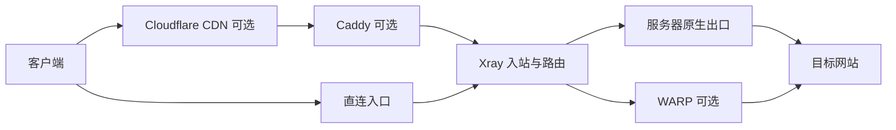

# Xray 多协议安装与管理脚本

[](https://github.com/0157Martin/v2ray-manager/actions/workflows/ci.yml)

作者：[0157Martin](https://github.com/0157Martin)

这是一个面向 **Debian/Ubuntu** 的 Xray Core 安装与运维脚本，适用于你拥有或获授权管理的
服务器。它通过 `v2ray` 命令提供交互菜单，同时支持 VLESS、Trojan、VMess，REALITY 或
常规 TLS，以及 RAW、XHTTP、WebSocket、gRPC 等传输组合。

脚本不会在安装结束时自动打印连接凭据。安装后由你选择具体入站，再导出分享链接或原生
Xray 客户端 JSON。一个 Xray 服务可以运行多个独立入站；每个入站还可以生成最多 10 条
具有独立凭据、可同时使用的子链接。

快速导航：[选择协议](#如何选择协议) · [安装](#一行安装) · [管理命令](#管理命令) ·
[Caddy](#caddy-网站伪装与反向代理) · [非交互安装](#非交互安装) ·
[WARP](#warp-出站管理) · [连接排障](#导入后延迟为--1--无法连接) ·
[完整项目讲解](docs/PROJECT_GUIDE.md)

第一次使用建议先阅读 [项目使用与原理指南](docs/PROJECT_GUIDE.md)。它按客户端、Caddy、
Xray、WARP 和目标网站的实际流量顺序解释组件职责，并给出安装、端口规划、多人使用、
更新回滚和延迟 `-1` 的操作步骤。



详细的路径匹配、路由决策、配置生成、systemd 健康检查和失败回滚图见
[转发机制原理图](docs/PROJECT_GUIDE.md#4-转发机制原理图)与
[项目运行原理图](docs/PROJECT_GUIDE.md#5-项目运行原理图)。

## 功能概览

- 安装或更新 Xray Core，并校验官方发布包的 SHA-256 摘要。
- 交互选择 12 种协议组合；安装过程不会静默创建或输出默认链接。
- 管理多个入站，包括添加、修改、启用、停用、删除和批量导出。
- 为单个入站维护 1–10 个独立用户凭据，配置失败时自动回滚。
- 自动生成并校验 UUID、REALITY X25519 密钥、Short ID 和 TLS 证书。
- 从现有证书导入，或使用 Certbot 申请及续期；部署失败恢复原证书。
- 安装 Caddy，创建伪装站点，或为 XHTTP/WebSocket 配置本机反向代理。
- 提供防火墙、服务状态、日志、Speedtest、回程路由、丢包和延迟诊断。
- 自动保留最近 10 份配置备份，支持 Xray、管理脚本和配置的独立更新与回退。
- 使用低权限 `xray` 系统账户，并对 systemd 服务进行基础加固。

## 如何选择协议

如果没有必须兼容的旧客户端，可从下面三类中选择：

- **直接连接、没有自有证书：**优先选择 `VLESS-REALITY-Vision-RAW`。
- **需要 Cloudflare 橙云或 HTTP CDN：**选择普通 TLS 的 XHTTP、WebSocket 或 gRPC；其中
  WebSocket 的客户端和 CDN 兼容范围通常最广。
- **已有旧版客户端：**使用 VMess 或传统 Trojan 组合；新部署优先考虑 VLESS。

| 编号 | 菜单名称 | 适用场景 | Cloudflare 普通橙云 |
| --- | --- | --- | --- |
| 1 | VLESS-REALITY-Vision-RAW | 推荐的高性能直连方案，无需自有证书 | 不支持 |
| 2 | VLESS-REALITY-XHTTP | 使用 XHTTP 传输，但 REALITY 仍需直连 | 不支持 |
| 3 | VLESS-REALITY-gRPC | 使用 gRPC 传输，但 REALITY 仍需直连 | 不支持 |
| 4 | VLESS-XHTTP-TLS | 自有域名、证书、Caddy 或 HTTP CDN | 支持 |
| 5 | VLESS-WebSocket-TLS | 广泛兼容客户端和 HTTP CDN | 支持 |
| 6 | VLESS-gRPC-TLS | 已有 HTTP/2 或 gRPC 反向代理 | 有条件支持 |
| 7 | Trojan-REALITY-RAW | 需要 Trojan 客户端语义的 REALITY 直连 | 不支持 |
| 8 | VMess-TCP | 无 TLS 的旧版兼容或可信链路 | 不支持 |
| 9 | VMess-WebSocket-TLS | 旧客户端与 HTTP CDN 兼容 | 支持 |
| 10 | VMess-gRPC-TLS | 旧客户端与现有 HTTP/2 反代兼容 | 有条件支持 |
| 11 | Trojan-WebSocket-TLS | 传统 Trojan、WebSocket 和 TLS | 支持 |
| 12 | VLESS-TLS-Vision-RAW | 自有证书的 Vision 直连方案 | 不支持 |

“不支持橙云”不等于不能使用 Cloudflare DNS。可以把域名托管在 Cloudflare，但应将代理
状态设为 **DNS only（灰云）**，让客户端直接连接服务器。

### Cloudflare 使用范围

本项目没有任何协议必须经过 Cloudflare。Cloudflare 可以只负责 DNS，也可以作为可选的
HTTP/HTTPS 反向代理；是否开启橙云取决于所选协议。使用灰云（DNS only）时，客户端仍然
直接连接 VPS，Cloudflare 不转发流量。

普通橙云只代理 Cloudflare 支持的 HTTP/HTTPS 端口。HTTPS 推荐使用 `443`，也支持
`2053`、`2083`、`2087`、`2096` 和 `8443`；项目使用 CDN 域名导出时固定生成公网
`443` 入口。WebSocket 可用于 Cloudflare 各套餐。gRPC 节点还需要 TLS、HTTP/2、ALPN、
代理状态为橙云、SSL/TLS 模式至少为 Full，并在控制台打开 `Network → gRPC`。

RAW、REALITY、VMess TCP 等任意 TCP 流量不能由普通橙云转发。确需让这类流量经过
Cloudflare 时，需要单独评估 Cloudflare Spectrum；任意 TCP/UDP 代理通常涉及 Enterprise
套餐，不能把 Spectrum 能力等同于普通免费橙云。

Cloudflare 官方参考：

- [代理状态与 DNS only](https://developers.cloudflare.com/dns/proxy-status/)
- [Cloudflare 支持的 HTTP/HTTPS 端口](https://developers.cloudflare.com/fundamentals/reference/network-ports/)
- [WebSocket 支持及限制](https://developers.cloudflare.com/network/websockets/)
- [gRPC 要求与开启方式](https://developers.cloudflare.com/network/grpc-connections/)
- [Spectrum TCP/UDP 代理](https://developers.cloudflare.com/spectrum/)

普通 TLS 入站需要有效证书。脚本不会自动修改 DNS、Caddy 或 Nginx；只有你主动进入
“Caddy 网站管理”或执行 `v2ray caddy ...` 时才会写入 Caddy 配置。你可以导入已有 PEM
证书和私钥；未提供时，脚本先查找匹配证书，找不到才使用 Certbot。自动申请要求域名指向
本机且公网 TCP 80 可达，并会接受 Let's Encrypt 服务条款。默认 standalone 模式要求
本机 80 空闲；已有网站可设置 `V2M_ACME_WEBROOT=/var/www/html` 使用 webroot 验证。

## 一行安装

请使用 root 用户运行：

```bash
bash <(curl -fsSL https://raw.githubusercontent.com/0157Martin/v2ray-manager/main/install.sh)
```

只有 `wget` 时：

```bash
bash <(wget -qO- https://raw.githubusercontent.com/0157Martin/v2ray-manager/main/install.sh)
```

生产服务器建议先审阅 [install.sh](https://github.com/0157Martin/v2ray-manager/blob/main/install.sh) 和 [v2ray.sh](https://github.com/0157Martin/v2ray-manager/blob/main/v2ray.sh)。

安装只部署 Xray Core、systemd 服务和管理命令，不会弹出协议选择，也不会创建或显示默认
链接。先手动添加需要的协议，再检查和导出：

```bash
v2ray add                # 手动选择协议并添加第一个入站
v2ray doctor             # 检查配置、证书、监听端口和服务状态
v2ray inbounds           # 查看可用的入站 ID
v2ray links              # 输出全部启用入站的分享链接
```

也可以运行 `v2ray`，进入“入站管理 → 添加新入站”。如需输出单个入站，先用
`v2ray inbounds` 查看实际 ID，再运行 `v2ray link <入站ID>`。

## 管理命令

```bash
v2ray                  # 打开菜单
v2ray add              # 添加独立入站
v2ray inbounds         # 查看入站列表
v2ray links            # 输出全部启用入站链接
v2ray users            # 打开子链接用户管理菜单
v2ray users list       # 按协议分组查看入站及链接数量
v2ray users list primary          # 查看指定入站的链接用户
v2ray users add primary 2         # 新增两条链接，保留现有凭据
v2ray users delete primary 3      # 删除第 3 条链接
v2ray users replace primary 2     # 重新生成第 2 条链接的凭据
v2ray users show primary          # 输出该入站的全部分享链接
v2ray users set primary 5         # 兼容模式：直接设置链接总数
v2ray firewall         # 放行已启用入站的本机 UFW/firewalld TCP 端口
v2ray info             # 查看版本和连接信息
v2ray version          # 查看管理脚本版本
v2ray change           # 打开分级修改菜单
v2ray config           # change 的兼容别名
v2ray link             # 重新显示默认入站链接
v2ray link primary edge.example.net # 用 CDN 域名导出，SNI/Host 仍使用原证书域名
v2ray client           # 输出默认启用入站的 Xray 客户端 JSON
v2ray client primary   # 按入站 ID 导出；ID 见 v2ray inbounds
v2ray status           # 查看服务状态
v2ray start
v2ray stop
v2ray restart
v2ray log              # 查看最近 100 条日志
v2ray speedtest        # 测试服务器下载、上传速度和延迟
v2ray route 1.1.1.1    # 测试 VPS 到目标的回程路由、丢包和逐跳延迟
v2ray warp             # 管理全部协议共用的 WARP 出站策略
v2ray caddy            # 打开 Caddy 网站管理菜单
v2ray update           # 更新 Xray Core，保留配置
v2ray upgrade          # 一键更新项目脚本、迁移数据并保留现有链接
v2ray update.sh        # upgrade 的兼容别名
v2ray rollback.sh      # 恢复上一次更新前的管理脚本
v2ray rotate           # 轮换 REALITY 密钥和 Short ID
v2ray backup           # 创建配置备份
v2ray restore          # 恢复最近一份备份
v2ray doctor           # 运行综合诊断
v2ray uninstall
```

主菜单按“安装、入站管理、连接与导出、Xray 服务、Caddy、WARP、维护诊断、卸载”分组，并显示
Xray、Caddy 运行状态以及启用、停用入站数量。安装结束时不会自动输出凭据；需要分享链接
或客户端 JSON 时，进入“连接与导出”并选择对应入站。子菜单中选择 `0` 返回主菜单。

“连接与导出 → 子链接用户管理”提供查看、新增、删除、重新生成和输出链接。入站列表按
REALITY 直连、TLS HTTP/CDN、其他直连与旧版兼容分组，并直接显示每个入站的链接数量。
用户列表通过序号和脱敏凭据标识区分链接，避免普通查看操作打印完整 UUID。

这些链接共享协议、域名、端口、传输路径和 TLS/REALITY 参数，但 UUID（Trojan 中作为
密码）不同，可以同时使用。新增操作保留全部已有凭据；删除只移除指定序号；重新生成只让
指定序号的旧链接失效。删除后序号会重新连续排列。每个入站至少保留 1 条、最多 10 条链接。
`v2ray client <入站ID>` 只导出第一条凭据；使用 `v2ray users show <入站ID>` 或
`v2ray link <入站ID>` 查看该入站的全部分享链接。旧命令 `v2ray users <入站ID> <数量>`
继续可用，等同于 `v2ray users set <入站ID> <数量>`。

“维护与诊断 → 路由、丢包与延迟测试”使用 `ping` 和 10 轮 MTR 报告测试 VPS 到指定客户端
公网 IP 或域名的回程方向，并显示逐跳丢包和平均延迟。首次使用会从系统仓库安装
`mtr-tiny`、`iputils-ping` 和 `traceroute`。真实去程依赖客户端运营商网络，必须从客户端
发起；菜单会根据当前节点地址和端口生成 Windows PowerShell、Linux/macOS 测试命令。
逐跳星号或中间节点丢包可能只是路由器限制 ICMP，需结合最终目标的丢包与延迟判断。

执行 `rotate` 后旧客户端链接会立即失效，需要重新导入新链接。

`v2ray speedtest` 也可从“维护与诊断 → Speedtest 服务器测速”运行。脚本优先使用已安装的
Ookla `speedtest` 或 `speedtest-cli`；均不存在时安装系统仓库的 `speedtest-cli`。测速会
连接外部 Speedtest 服务器、暴露服务器公网 IP，并消耗一定流量，但不会修改或重启 Xray。

## Caddy 网站伪装与反向代理

主菜单的“Caddy 网站管理”支持通过 Caddy 官方 Debian/Ubuntu 稳定仓库和 GPG key 自动安装，
并提供两种站点：

- 静态伪装网站：为域名生成独立站点目录和简单首页，由 Caddy 自动申请及续期 HTTPS 证书。
- 本机反向代理：把域名代理到 `127.0.0.1:端口`、`localhost:端口` 或 `[::1]:端口`，适合
  本机面板、API 或 Web 应用。为避免开放代理，不接受公网或局域网后端地址。

也可以使用非交互命令：

```bash
v2ray caddy install
v2ray caddy static www.example.com
v2ray caddy reverse app.example.com 127.0.0.1:8080
v2ray caddy xray cdn.example.com 127.0.0.1:24443 /a1b2c3
v2ray caddy status
v2ray caddy log
```

项目不会覆盖现有 Caddyfile，而是在备份后自动追加一次
`import /etc/caddy/conf.d/*.caddy`，站点配置按域名单独保存。写入前备份主 Caddyfile，
新配置必须通过 `caddy validate` 才会 reload；失败时恢复旧站点配置。Caddy 自动 HTTPS
要求域名 A/AAAA 记录指向服务器，并确保公网 TCP 80 和 443 可达。

标准 Caddy 与 Xray 不能同时监听同一 TCP 80/443。若 Xray 或其他程序已占用其中任一端口，
管理器会拒绝安装或配置 Caddy，不会停止现有服务。请先把 Xray 入站改到其他端口，再配置
Caddy。普通 `reverse` 面向 HTTP Web 应用；`xray` 模式按 XHTTP/WS 路径反向代理到使用同一
域名证书的本机 Xray TLS 入站，并让其他路径显示静态伪装页。它不能代理 REALITY/RAW。
建议 Xray 使用 `24443` 等高位端口，Caddy 独占公网 `80/443`。应用前应确认 Xray 的域名、
证书和传输路径与 Caddy 参数完全一致。

在菜单中创建 Xray XHTTP/WS 路径反代时，管理器会按输入的 TLS 域名查找已启用的对应
入站，并自动填入它实际使用的本机端口和传输路径。直接按 Enter 会采用显示的值；没有
匹配入站时默认使用 `127.0.0.1:24443` 和 `/xhttp`。手动输入 `custom-path` 会规范化为
`/custom-path`，包含空格或连续 `/` 的路径会被拒绝并返回 Caddy 菜单，不会退出到 shell。

自定义 Cloudflare/CDN 入口域名仅适用于 HTTP 兼容的 TLS XHTTP/WebSocket 节点。使用
`v2ray link <入站ID> <CDN域名>` 导出时，连接地址和客户端端口会改为指定域名与
`443`，但 TLS SNI、HTTP Host 和证书域名仍保留节点原域名。为防止链接暴露 IP 或把 IP
误当作证书域名，该参数只接受完整域名，不接受 IP 地址。Cloudflare 代理不适用于
VLESS RAW、REALITY 或普通 TCP 节点。gRPC 虽可由 Cloudflare 转发，但不使用这个
XHTTP/WebSocket 专用的地址覆盖导出入口。

分享链接不写入或自动探测服务器公网 IP。普通 TLS 节点使用证书域名作为入口；REALITY
和无 TLS 节点安装时要求填写一个指向 VPS 的入口域名，Cloudflare 中必须按协议选择灰云
或橙云。已有节点若只保存了 IP，需要在“修改配置 → 更改服务器地址”中改成完整域名后再导出。

## 官方文档对应关系与客户端 JSON

项目参考 Xray 官方文档的[服务器篇](https://xtls.github.io/document/level-0/ch07-xray-server.html)、
[证书篇](https://xtls.github.io/document/level-0/ch06-certificates.html) 和
[客户端篇](https://xtls.github.io/document/level-0/ch08-xray-clients.html)，实现 TLS Vision、
webroot 证书申请和原生客户端配置导出。生成字段会使用 Xray 最新稳定版进行 CI 验证；
官方教程中的网站回落、地区分流、SSH 和内核参数需要根据服务器用途配置，脚本不会自动套用。

选择菜单协议 12，或使用 `V2M_PROFILE=vless-tls-raw`，即可部署 TLS + Vision。该组合需要自有域名及有效证书，直接连接 Xray 的 TLS 端口，不能把它当成 WebSocket 节点放到普通 HTTP CDN 后面。

以 root 在服务器上导出：

```bash
umask 077
v2ray client primary > client.json
```

将 `client.json` 安全复制到客户端电脑，用 Xray Core 运行 `xray run -config client.json`，应用连接本机 SOCKS `127.0.0.1:10800` 或 HTTP `127.0.0.1:10801`。此 JSON 供 Xray Core 使用，GUI 客户端是否支持完整 JSON 导入取决于其功能。导出前核对启用入站与运行配置，自动填入 UUID、SNI、流控及传输参数；不导出服务端私钥。TLS 保持正常 CA 校验，自建 CA 需另外配置客户端信任。

Certbot 续期钩子执行 `v2ray cert-refresh "$RENEWED_LINEAGE"`：仅更新登记了该来源的域名，先验证有效期、域名、私钥和 CA 链，再部署并检查 Xray 配置；运行中的服务重启失败会恢复旧证书，停止的服务保持停止。失败时保留备份目录并报错。

使用 acme.sh 时，按官方教程先用 `--install-cert` 将证书部署到稳定路径，再以 `V2M_CERT_FILE` / `V2M_KEY_FILE` 导入；脚本不再自动读取 `.acme.sh` 内部工作文件。外部证书的后续同步需由相应 ACME 客户端配置部署钩子，Certbot 钩子不会自动接管它。

## 非交互安装

自动化部署时可以传入环境变量：

```bash
export V2M_NONINTERACTIVE=1
export V2M_PORT=443
export V2M_PROFILE=vless-reality-raw
export V2M_ADDRESS=edge.example.com
export V2M_SERVER_NAME=dl.google.com
export V2M_REMARK=my-server
bash <(curl -fsSL https://raw.githubusercontent.com/0157Martin/v2ray-manager/main/install.sh)
```

`V2M_UUID` 可省略，脚本会自动生成。`V2M_ADDRESS` 必须是指向服务器的完整入口域名，脚本
不会自动探测或把公网 IP 写入分享链接。未显式指定端口时，直连协议从 `443` 开始寻找
空闲端口；HTTP/CDN 协议从 `24443` 开始寻找本机后端端口，为 Caddy 的公网 `443` 留出
位置。脚本不会停止端口占用者。不要在共享日志中输出 UUID 或生成后的导入链接。

`V2M_PROFILE` 的可选值与交互菜单一致（例如 `vless-reality-raw`、`trojan-reality-raw`、`vmess-tls-ws`）。XHTTP/WebSocket 可用 `V2M_PATH` 指定路径；TLS 组合须设置 `V2M_SERVER_NAME` 为你拥有的域名，可用 `V2M_CERT_FILE` 和 `V2M_KEY_FILE` 指定证书，或让脚本自动查找/申请。`V2M_ACME_EMAIL` 可选，用于 Certbot 账户邮箱。

## 更新与回退

`v2ray update` 在临时目录下载并校验新内核和 GeoData，用新内核检查当前配置后才替换文件。运行中的服务重启后会连续检查 5 秒；文件替换或健康检查失败时自动恢复旧内核与 GeoData。原先停止的服务保持停止。自动回退失败时，会输出保留的恢复文件目录。该检查用于发现启动故障，不代表已验证客户端到服务器的端到端连通性。

`v2ray upgrade` 是服务器已安装项目的一键更新入口，`v2ray update.sh` 作为兼容别名继续可用。
更新器通过 GitHub API 解析 `main` 的完整提交 SHA，再从该固定提交下载脚本，避免一次操作中
版本漂移。新脚本通过 Bash 语法和项目标识检查后才会替换当前命令，然后自动执行数据迁移、
重建 Xray 配置并比较更新前后的入站连接参数。UUID/密码、域名、端口、传输路径、TLS/REALITY
参数和证书路径保持不变，因此原分享链接继续有效。若迁移失败或连接参数发生非预期变化，
配置和管理脚本都会恢复到更新前版本。

从 5.2.0 开始，脚本会在运行管理命令时检查数据结构版本。由旧版 `v2ray update.sh` 首次
升级到 5.2.0 后，如果旧更新器尚未调用迁移，新脚本会在下一次运行 `v2ray`、`v2ray doctor`
或其他管理命令时自动完成迁移，无需重新生成或重新导入链接。

可以设置 `V2M_MANAGER_REF` 为完整的 40 位提交 SHA，以部署指定版本或绕过提交查询的 API
限流。下载通过 HTTPS，并检查 Bash 语法与项目标识；这不是独立签名验证。

管理脚本更新前会保存 `/var/backups/v2ray-manager/manager.previous.sh`，可用 `v2ray rollback.sh` 恢复。若新管理命令本身无法运行，可用 root 执行 `install -m 755 /var/backups/v2ray-manager/manager.previous.sh /usr/local/bin/v2ray`。重新运行安装不会升级已存在的内核；请使用独立的 `v2ray update` 命令。

## 安装与手动添加协议

一行安装命令不会显示协议列表。它先安装 Xray Core、写入可启动的空入站配置并安装
`v2ray` 管理命令；安装结束时也不会输出 UUID 或分享链接。随后运行 `v2ray add`，或进入
“入站管理 → 添加新入站”，再自行选择协议。重新运行安装/修复会保留已有入站、凭据和
链接。

CI、云初始化需要在安装时直接创建入站时，必须明确设置 `V2M_NONINTERACTIVE=1`，并建议
同时提供 `V2M_PROFILE` 等参数；未提供的参数才使用脚本默认值。不设置该变量时，即使没有
交互终端，也只完成核心安装，不会静默创建默认协议。

手动添加入站时需要确认：

1. 协议组合。
2. 监听端口。直连协议从 `443` 开始寻找空闲端口；HTTP/CDN 协议默认使用本机后端端口
   `24443`，为 Caddy 的公网 `443` 留出位置。
3. 客户端入口域名。分享链接不会写入或自动探测公网 IP。
4. TLS 证书域名，或 REALITY 目标域名。REALITY 默认目标是 `dl.google.com`，应选择
   服务器能稳定访问、支持 TLS 1.3 且与服务器网络位置合理的站点。
5. 节点备注。UUID、REALITY 密钥和 Short ID 由脚本生成并验证。

新增入站后，脚本会检测已启用的本机 UFW 或 firewalld，并自动放行全部已启用入站的 TCP 端口；也可随时运行 `v2ray firewall` 重试。未启用这两种防火墙时，脚本不会猜测或改写 iptables/nftables 规则。

云服务商安全组仍需在控制台手动放行所选 TCP 端口——它属于云账户权限，脚本没有也不应保存该账户的 API 凭据。本脚本不会自动修改 DNS 或系统代理。

## WARP 出站管理

主菜单的“WARP 出站管理”对全部启用的 VLESS、VMess 和 Trojan 入站统一生效，不需要逐个
选择协议。项目安装 Cloudflare 官方 Linux 客户端，并将它设置为只监听
`127.0.0.1:40000` 的本机代理；Xray 根据路由规则使用该代理，因此不会改变服务器默认路由，
也不会接管 SSH、Caddy、软件更新或其他系统进程。

推荐使用“指定域名通过 WARP”：

```bash
v2ray warp install
v2ray warp selective 'geosite:netflix,domain:openai.com,domain:chatgpt.com'
v2ray warp status
v2ray warp test
```

完整菜单提供以下操作：

```text
1) 安装/初始化 WARP
2) 查看 WARP 状态与出口 IP
3) 全部协议的公网 TCP 使用 WARP
4) 指定域名使用 WARP（推荐）
5) IPv4 / IPv6 出站策略
6) 流媒体与 ChatGPT 可用性检测
7) 停用 WARP 策略
8) 修复/重新生成配置
9) 卸载 WARP
0) 返回
```

IPv4/IPv6 策略可通过菜单选择自动双栈、仅 IPv4 或仅 IPv6，也可分别执行
`v2ray warp dual`、`v2ray warp ipv4`、`v2ray warp ipv6`。这些设置统一应用到 WARP
出站，不区分入站协议。`v2ray warp check` 检查 Netflix、Disney+ 和 ChatGPT 当前 HTTP
可访问性，`v2ray warp repair` 会恢复 WARP 服务、本机代理和 Xray 路由配置。

安装和修复只有在 `127.0.0.1:40000` 开始监听、且 Cloudflare trace 返回 `warp=on` 后才会
报告成功。`warp-cli connect` 完成较慢时最多等待 30 秒；现有注册无法启动代理时会自动断开
并重新注册免费 WARP 设备。检测或修复失败会显示错误并返回 WARP 菜单，不会退出到 shell。

Local Proxy 会显式使用 MASQUE。如果状态长期停在 `Connecting` 或 `Performing happy eyeballs`，
脚本不会继续反复删除有效注册，而会运行上游诊断。也可手动执行：

```bash
v2ray warp diagnose
```

诊断会显示系统时间同步、IPv4/IPv6 路由、UFW、`warp-cli status` 和 `warp-svc` 日志。
服务日志只保留连接阶段、警告和错误行，并在显示前移除许可证、令牌、密钥、账户、设备、
公钥和 UUID；不要在公开截图中展示未经脱敏的 `journalctl -u warp-svc` 原始调试日志。
服务器本机及服务商出站策略需要允许 WARP 的 UDP `443`、`500`、`1701`、`4500`、`4443`、
`8443`、`8095`，以及 TCP `443` 回退。卡在 Happy Eyeballs 表示 Cloudflare 上游隧道尚未
建立；此时 `127.0.0.1:40000` 不监听是结果，并不是需要开放公网入站 40000。

需要让所有 Xray 入站的公网 TCP 流量使用 WARP 时，可执行 `v2ray warp all`。为避免代理客户端
访问内网时绕过边界，`geoip:private` 始终使用原生直连；这里的“全部”指所有协议产生的
公网 TCP 流量。Cloudflare 本机代理模式不承诺可靠转发 UDP，因此 UDP 保持原生出口，避免
QUIC 或其他 UDP 连接被错误送入代理后超时。运行 `v2ray warp off` 可让全部协议恢复原生出口，`v2ray warp uninstall`
会先恢复原生出口再移除 WARP 客户端。

WARP 只能改变服务器出站路径和出口 IP，不能替代 REALITY/TLS、防火墙或 SSH 安全设置，
也不保证特定流媒体长期解锁。菜单中的出口检测以 Cloudflare `cdn-cgi/trace` 返回
`warp=on` 为成功标准。策略变更会先备份现有配置，再重建并校验 Xray；服务健康检查失败时
自动恢复之前的配置和策略。

实现依据：[Cloudflare Linux 客户端](https://developers.cloudflare.com/warp-client/get-started/linux/)、
[Cloudflare WARP Local proxy 模式](https://developers.cloudflare.com/warp-client/warp-modes/)、
[Cloudflare WARP 防火墙端口](https://developers.cloudflare.com/cloudflare-one/team-and-resources/devices/cloudflare-one-client/deployment/firewall/)、
[Xray 路由规则](https://xtls.github.io/config/routing.html)。

## 导入后延迟为 -1 / 无法连接

`-1` 表示客户端测试没有成功，单凭这个结果不能区分入口地址、端口阻断、协议兼容或握手问题。先运行 `v2ray version`、`v2ray doctor` 和 `v2ray log`，确认服务器确实已部署修复后的脚本。诊断会检查全部入站端口、REALITY 目标握手和导出参数，但无法从本机证明公网端口可达。

- 修改入站后，用 `v2ray links` 重新导出并重新导入客户端；单条链接始终读取最新的启用入站状态。
- 分享地址必须是客户端能访问且指向服务器的入口域名。NAT/WARP 的出口地址不一定是入口；NAT 环境还需核对外部端口映射。
- `v2ray firewall` 只处理本机已启用的 UFW/firewalld；云安全组需要放行**链接中的 TCP 端口**。直连协议优先使用 443，HTTP/CDN 后端优先使用 24443；始终以实际导出链接和反向代理配置为准。
- 从客户端网络检查 TCP 可达性，例如 Windows PowerShell 的 `Test-NetConnection <服务器地址> -Port <节点端口>`。TCP 成功仍不代表 REALITY/TLS 握手成功。
- 核对客户端及内核是否支持所选协议组合。RAW 服务端在分享链接中使用 `type=tcp`，这是分享格式的兼容写法，无须手动改成 `raw`。

导出器遇到未知地址或入站状态与配置不一致时会报错，避免生成可导入却注定失败的链接。排查时不要公开完整链接、UUID、私钥或未脱敏日志。

UUID 默认自动生成并写入服务器配置和链接；TLS 模式自动查找/申请并导入证书，校验域名、有效期和私钥匹配。导出前会再次校验证书或 REALITY 密钥对。REALITY 模式不需要申请普通 TLS 证书；普通 TLS 模式的客户端仍须信任证书颁发机构，脚本不会通过关闭证书验证来绕过失败。

## 从 1.x 升级

重新运行一行安装命令即可。检测到本项目旧版 `/etc/v2ray/manager.env` 和旧服务定义时，脚本会停用旧的 `v2ray.service`，但保留旧文件便于人工回退。2.x 使用新的 `xray.service` 和 `/etc/xray` 配置，不会静默删除旧配置。

## 文件位置

| 内容 | 位置 |
| --- | --- |
| Xray Core | `/usr/local/bin/xray-core` |
| 管理命令 | `/usr/local/bin/v2ray` |
| GeoData | `/usr/local/share/xray/` |
| 配置 | `/etc/xray/config.json` |
| 管理状态 | `/etc/xray/manager.env` |
| 入站状态 | `/etc/xray/nodes/*.env` |
| systemd 服务 | `/etc/systemd/system/xray.service` |
| 配置备份 | `/var/backups/v2ray-manager/` |

卸载仅删除 2.x 脚本创建的 Xray 文件；专用 `xray` 系统账户和旧版回退文件会保留。
如果安装前 `/usr/local/bin/v2ray` 已被其他管理器使用，脚本会先将它保存到 `/var/backups/v2ray-manager/legacy-v2ray-command`；卸载时自动恢复。

## 仓库结构

```text
.
├── install.sh
├── v2ray.sh
├── CHANGELOG.md
├── config/
├── src/
├── templates/
├── tests/
├── tools/
├── docs/
└── .github/
```

每次推送都会在 Ubuntu 24.04 上运行逐文件 Bash 语法检查、ShellCheck、单元测试、升级/恢复故障模拟和安装引导测试，并下载 Xray 最新稳定版验证全部协议组合及多入站配置。故障模拟不操作真实 systemd 或本机安装目录；真实服务器安装、证书申请和端到端连接仍需要部署环境验证。
