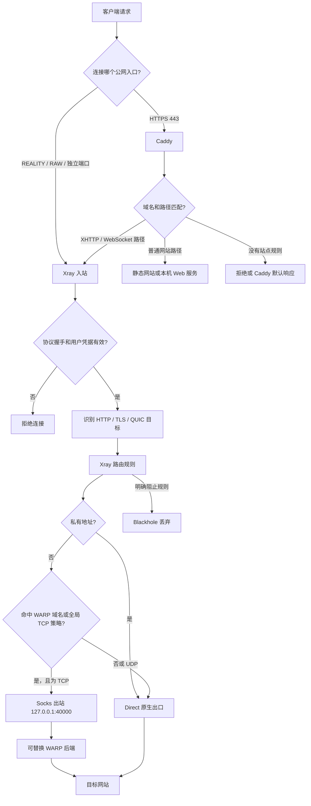
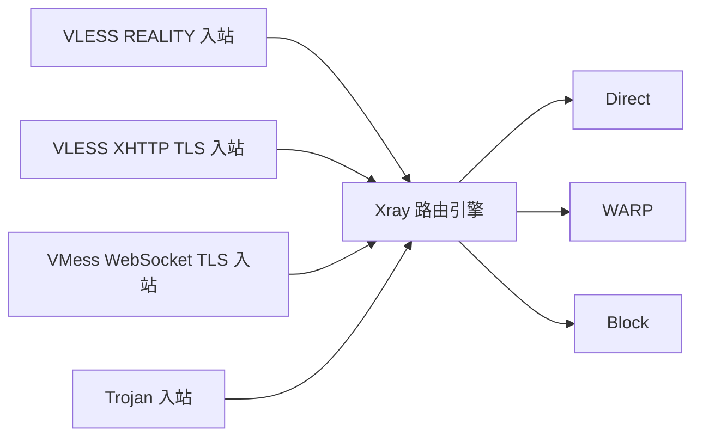
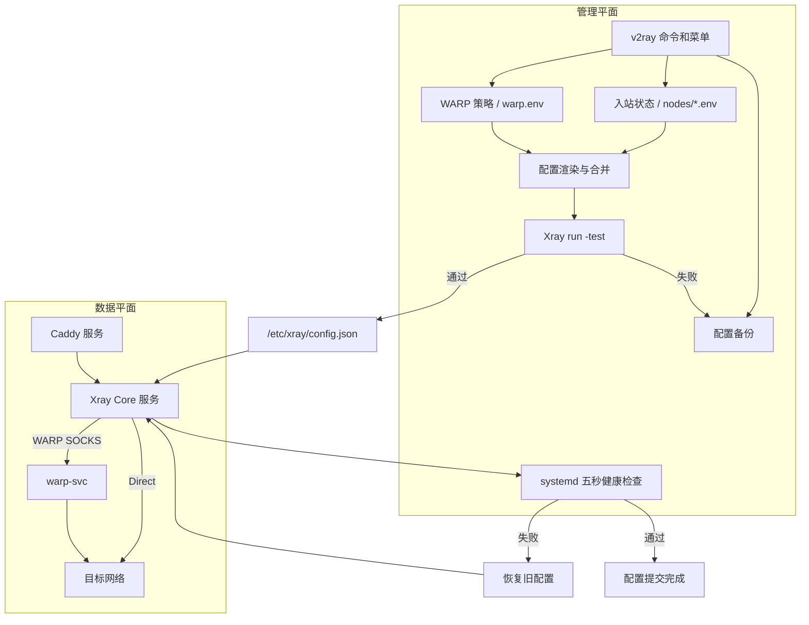
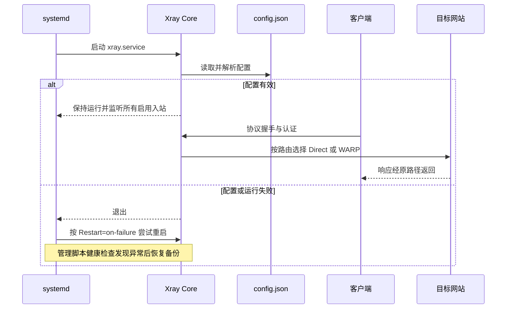

# v2ray-manager 项目使用与原理指南

这份文档面向第一次部署和日常维护的用户，解释项目各组件做什么、一次连接如何经过服务器、
应该按什么顺序操作，以及出现问题时先检查哪里。

## 1. 项目解决什么问题

`v2ray-manager` 将 Xray Core 的安装、协议配置、凭据管理、证书、Caddy、WARP、更新、备份和
诊断集中到 `v2ray` 命令中。它管理的是一台 Debian/Ubuntu 服务器上的 Xray 服务，不是客户端
软件，也不会自动修改客户端设备、Cloudflare 控制台或云服务商安全组。

安装完成时只部署核心和管理命令，不创建默认协议。用户随后通过“入站管理”选择需要的协议，
再主动导出链接。这避免安装脚本在没有确认域名、证书和端口的情况下生成一个不一定能用的节点。

## 2. 先理解五个对象

| 对象 | 作用 | 是否改变分享链接 |
| --- | --- | --- |
| 入站 | 客户端连接服务器时使用的协议、端口、域名和传输方式 | 是 |
| 子链接用户 | 同一个入站中的独立 UUID 或 Trojan 密码 | 只改变对应子链接 |
| Caddy | 公网网站入口、自动 HTTPS、伪装网站和 HTTP 反向代理 | 可能改变公网入口方式 |
| WARP | Xray 访问目标网站时使用的可选出站 | 否 |
| Cloudflare CDN | 位于客户端和服务器之间的可选 HTTP/CDN 入口 | 只适用于兼容协议 |

入站决定“客户端如何进入服务器”，出站决定“服务器如何访问目标网站”。Caddy 位于 Xray 入站
之前，WARP 位于 Xray 出站之后，两者职责不同。

## 3. 三种典型流量路径

### 3.1 REALITY 直连

```text
客户端
  └─ VLESS/Trojan + REALITY ─→ Xray 公网端口
                                  └─ 原生出口 ─→ 目标网站
```

REALITY 自己完成握手和伪装，不需要 Caddy，也不能经过 Cloudflare 普通橙云。域名可以托管在
Cloudflare，但应使用 DNS only（灰云）。

### 3.2 Caddy + TLS HTTP 传输

```text
客户端
  └─ HTTPS 443 ─→ Caddy
                    ├─ 普通网页路径 ─→ 伪装网站
                    └─ 指定 XHTTP/WS 路径 ─→ Xray 本机 TLS 端口
                                                └─ 原生或 WARP 出口 ─→ 目标网站
```

Caddy 统一监听公网 80/443，Xray 使用 `127.0.0.1:24443` 等后端端口。Caddy 只转发已配置的
域名和路径，不会让所有 Xray 协议自动经过它。

### 3.3 Cloudflare 橙云 + Caddy

```text
客户端 ─→ Cloudflare 橙云 ─→ Caddy 443 ─→ Xray XHTTP/WS 后端 ─→ 目标网站
```

该路径只适用于普通 TLS 的 HTTP 兼容传输。REALITY、RAW、VMess TCP 等任意 TCP 协议不能
通过普通橙云转发。

## 4. 转发机制原理图

下面的图展示一条客户端请求进入服务器后的完整决策过程。Caddy 只处理配置给它的 HTTP/TLS
站点；直接连接 Xray 端口的 REALITY、RAW 等流量不会经过 Caddy。



### 4.1 Caddy 如何转发

Caddy 根据站点域名和路径匹配请求。例如：

```text
https://node.example.com/              → 伪装网站
https://node.example.com/xhttp         → 127.0.0.1:24443 的 Xray 入站
https://app.example.com/               → 127.0.0.1:8080 的本机 Web 应用
```

项目为 Xray XHTTP/WS 生成路径匹配器，只将指定路径及其子路径交给 Xray。TLS 在 Caddy 与
客户端之间建立；Caddy 到项目当前 TLS 后端也使用 HTTPS，并设置与证书一致的 SNI。配置必须
通过 `caddy validate` 才会加载。

### 4.2 Xray 如何转发

Xray 先在入站完成协议握手和凭据校验，再根据目标地址选择出站：

1. `sniffing` 从 HTTP、TLS 或 QUIC 流量中识别目标域名，供路由规则使用；
2. `routing.rules` 从上到下匹配，第一条有效规则决定出站；
3. `direct` 使用服务器原生网络；
4. `warp` 把匹配的 TCP 请求交给本机 WARP SOCKS 代理；
5. `block` 使用 Blackhole 丢弃明确禁止的流量；
6. 未命中规则时使用第一项默认出站，本项目将 Direct 放在第一项。

WARP 模式下私有地址优先 Direct，防止本地或内网请求被送到外部隧道。UDP 保持 Direct，避免
Cloudflare Local Proxy 对 UDP 支持不明确时产生超时。

### 4.3 多入站与统一出站



每个入站可以有自己的协议、端口和用户，但它们进入同一个 Xray 路由引擎。因此 WARP 策略
天然可以对全部协议统一生效，不需要为每个入站复制一份出站配置。

## 5. 项目运行原理图

项目运行分为“管理平面”和“数据平面”。`v2ray` 命令负责写配置和维护服务；Xray、Caddy、
WARP负责实际转发流量。



### 5.1 配置变更事务

一次添加、修改、停用或删除入站会经历：

```text
读取状态 → 创建备份 → 生成临时 JSON → Xray 语法校验
→ 原子安装 config.json → 重启服务 → 观察 PID 和重启次数 5 秒
→ 成功提交，或失败恢复旧配置
```

配置文件通过校验只代表语法和 Xray 对象有效。公网端口、云安全组、DNS、CDN 和客户端兼容性
仍需通过 `v2ray doctor` 及客户端网络测试确认。

### 5.2 启动与常驻运行



Xray 以低权限 `xray` 系统账户运行，通过 systemd 获得绑定低端口所需的有限能力。管理脚本
必须由 root 执行，因为它需要安装程序、写入 `/etc/xray`、管理 systemd 和防火墙规则。

## 6. 推荐操作顺序

### 6.1 第一次安装

```bash
bash <(curl -fsSL https://raw.githubusercontent.com/0157Martin/v2ray-manager/main/install.sh)
```

安装完成后依次执行：

```bash
v2ray add
v2ray doctor
v2ray inbounds
v2ray links
```

`v2ray add` 才会显示协议选择。添加完成后会输出该入站的链接；以后可从“连接与导出”再次查看。

### 6.2 已安装服务器更新

```bash
v2ray upgrade
v2ray version
v2ray doctor
```

`upgrade` 更新管理脚本并迁移项目状态；`update` 只更新 Xray Core。两者不会主动更换 UUID、
端口、域名、证书路径或 REALITY 密钥。迁移造成连接参数意外变化时会恢复旧脚本和配置。

### 6.3 修改前先判断修改层级

- 改协议、端口、域名、传输路径：修改入站，客户端通常需要重新导入。
- 增加使用者：新增子链接用户，不影响已有用户。
- 只改变服务器出口：修改 WARP 策略，分享链接不变。
- 增加伪装网站或 HTTP 反代：修改 Caddy，不影响 REALITY 等直连入站。

## 7. 入站和子链接的原理

一个入站对应一个监听端口和一组协议参数。项目将每个入站保存成独立状态文件，然后合并生成
一份 `/etc/xray/config.json`。查看入站时会按 REALITY、TLS HTTP/CDN、其他直连和旧版兼容
分组，并显示该入站当前包含多少条链接。

一个入站可以拥有 1–10 个用户凭据。它们共享：

- 域名和端口；
- TLS/REALITY 和传输方式；
- XHTTP/WS 路径或 gRPC serviceName；
- 同一个 Xray 入站。

每个用户拥有独立 UUID；Trojan 使用独立密码。新增用户不改变旧凭据，删除或重新生成只影响
所选序号，因此多条子链接可以同时使用。

常用操作：

```bash
v2ray users list
v2ray users list <入站ID>
v2ray users add <入站ID> 2
v2ray users replace <入站ID> 2
v2ray users delete <入站ID> 3
v2ray users show <入站ID>
```

## 8. 端口如何规划

| 场景 | 公网端口 | Xray 监听 |
| --- | --- | --- |
| REALITY 直连且未使用 Caddy | 优先 443 | 公网地址:443 |
| Caddy + XHTTP/WS | Caddy 使用 80/443 | 127.0.0.1:24443 等后端端口 |
| 多个直连入站 | 每个入站独立端口 | 公网地址:不同端口 |
| Cloudflare 橙云 | 客户端通常连接 443 | Caddy 后端端口 |

同一个 IP 的同一个 TCP 端口不能同时由标准 Caddy 和 Xray 占用。脚本不会为了抢占 443 而停止
其他服务；端口被占用时会寻找空闲端口或要求先修改配置。云安全组仍需手动放行分享链接实际
使用的公网 TCP 端口。

## 9. Caddy 的作用和边界

Caddy 是服务器级 systemd 服务，可以同时加载多个域名站点，但每个站点只处理自己的域名和
路径。项目支持：

1. 安装 Caddy；
2. 创建静态伪装网站；
3. 反向代理本机 Web 服务；
4. 将 XHTTP/WS 路径代理到本机 Xray TLS 入站；
5. 查看状态和日志。

创建 Xray 路径反代时，脚本按 TLS 域名查找匹配入站并自动填入真实端口和路径。没有匹配项时
使用 `127.0.0.1:24443` 与 `/xhttp` 作为可修改默认值。Caddy 配置先经过 `caddy validate`，
reload 失败会恢复原站点文件。

Caddy 不负责：

- REALITY 握手；
- Xray 的用户凭据；
- WARP 出站；
- 云安全组和 DNS 控制台；
- 服务器所有网络流量。

## 10. WARP 的作用和边界

WARP 改变的是 Xray 到目标网站的出站路径。`v2ray-manager` 是主干控制器，统一管理策略，并负责
选择、下载、校验、调用、切换和回滚分支项目；主干不内置具体隧道实现。
`warp-wireguard-manager` 提供 WGCF + WireProxy，`warp-masque-manager` 提供 Cloudflare 官方
Linux 客户端 Local Proxy（优先 MASQUE，并测试官方客户端支持的 WireGuard 回退）。两者都向
Xray 提供 `127.0.0.1:40000` SOCKS5，不接管服务器默认路由，因此不会主动改变 SSH、Caddy 和
系统更新的出口。两个仓库属于主干控制的功能分支项目，并非 Git branch；它们各自拥有安装、
验证、运行、修复和卸载命令，也可以脱离主干独立部署，不需要修改 Xray 主体代码。

项目对全部入站协议统一应用 WARP 策略，可选择：

- 指定域名的 TCP 经过 WARP（推荐）；
- 所有 Xray 公网 TCP 经过 WARP；
- 自动双栈、仅 IPv4 或仅 IPv6；
- 停用后恢复原生出口。

UDP 和私有地址保持直连。WARP 不保证流媒体解锁，也不能替代 REALITY/TLS、防火墙或 SSH
安全设置。

安装成功必须同时满足：

1. 所选后端服务正在运行；
2. `127.0.0.1:40000` 已监听；
3. Cloudflare trace 返回 `warp=on`。

前两项只是运行条件，第三项才是流量验收。若旧 VPS 的多个 WARP 入口均失败，而同一安装器在新
VPS 返回 `warp=on`，应把旧机故障归类为服务商或机房上游限制。端口 `40000` 是回环监听，无需
也不应在云安全组或主机防火墙中开放公网入站。

状态卡在 `Connecting / Happy Eyeballs` 表示到 Cloudflare 上游的隧道没有建立。运行：

```bash
v2ray warp diagnose
```

诊断会检查时间、路由、防火墙、状态及经过脱敏的错误日志。不要公开原始
`journalctl -u warp-svc` 调试日志，其中可能包含注册凭据。`127.0.0.1:40000` 只在本机使用，
不应开放公网入站。

## 11. Cloudflare、Caddy、WARP 如何选择

| 目标 | 需要 Cloudflare 橙云 | 需要 Caddy | 需要 WARP |
| --- | --- | --- | --- |
| 部署 REALITY 直连 | 否 | 否 | 否 |
| 域名使用 Cloudflare DNS 灰云 | 否 | 否 | 否 |
| 提供正常 HTTPS 伪装网站 | 否 | 是 | 否 |
| XHTTP/WS 经过普通 CDN | 是 | 通常是 | 否 |
| 更换服务器访问网站的出口 | 否 | 否 | 可选 |
| 检测流媒体当前出口可访问性 | 否 | 否 | 可选 |

三者都不是项目运行的强制依赖。最简单的部署是 VLESS REALITY 直连；只有明确需要网站入口、
CDN 或特殊出站时再增加 Caddy、Cloudflare 或 WARP。

## 12. 备份、校验和回滚

配置变更采用以下顺序：

```text
保存旧配置 → 生成临时配置 → Xray 语法校验 → 安装新配置
→ 重启服务并观察健康状态 → 失败则恢复旧配置
```

备份位于 `/var/backups/v2ray-manager`，默认保留最近 10 份。TLS 证书、入站状态和 WARP 策略
随配置备份。常用命令：

```bash
v2ray backup
v2ray restore
v2ray rollback.sh
```

`restore` 恢复最近配置；`rollback.sh` 恢复上一次项目脚本。两者用途不同。

## 13. 延迟显示 -1 时如何判断

`-1` 只表示客户端没有完成测试，不能直接判断为服务器速度慢。按顺序检查：

1. `v2ray doctor`：配置、服务、监听和证书是否正常；
2. `v2ray inbounds`：使用的入站是否启用；
3. `v2ray link <入站ID>`：重新导出，避免使用旧参数；
4. `v2ray log`：是否有握手或配置错误；
5. 云安全组：是否放行链接中的 TCP 端口；
6. 域名：灰云/橙云是否符合协议要求；
7. 客户端：是否支持对应的 REALITY、XHTTP、Vision 或 gRPC 参数；
8. 从客户端网络测试服务器端口，不能只依赖 VPS 本机测试。

服务器上的 `ping`、MTR 和 Speedtest 只能描述服务器侧网络。客户端到 VPS 的真实去程必须从
客户端所在网络发起。

## 14. 重要文件

| 路径 | 内容 |
| --- | --- |
| `/usr/local/bin/v2ray` | 管理命令 |
| `/usr/local/bin/xray-core` | Xray Core |
| `/etc/xray/config.json` | Xray 最终运行配置 |
| `/etc/xray/manager.env` | 项目主状态和数据版本 |
| `/etc/xray/nodes/` | 各入站状态文件 |
| `/etc/xray/warp.env` | WARP 路由策略，不含 WARP 注册许可证 |
| `/etc/xray/tls/` | 项目部署的证书和私钥 |
| `/etc/caddy/conf.d/` | 项目创建的 Caddy 站点 |
| `/var/backups/v2ray-manager/` | 配置和脚本备份 |

`manager.env`、`nodes/`、TLS 私钥、备份和导出的客户端 JSON 都应视为敏感文件。不要将它们
上传到公开仓库或粘贴到公开问题中。

## 15. 最短场景建议

### 没有域名证书，追求简单

选择 `VLESS-REALITY-Vision-RAW`，域名使用灰云或普通 DNS，不安装 Caddy，不启用 WARP。

### 需要伪装网站或 CDN

选择普通 TLS XHTTP/WebSocket，先确保域名解析和证书条件，再让 Caddy 使用公网 80/443，
Xray 使用本机高位后端端口。

### 需要特殊网站走不同出口

保持现有入站不变，安装 WARP 后选择“指定域名使用 WARP”。先运行出口检测，再决定是否扩大
范围；不要一开始就让全部流量经过 WARP。

### 多人同时使用

保持一个协议入站，通过子链接用户管理新增独立凭据。需要完全不同的端口、协议、域名或传输
方式时，才创建新的入站。
